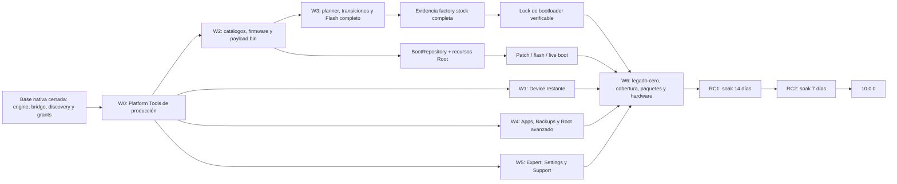

# PixelFlasher 10.0.0: plan de ejecución restante

## Propósito y fuente de verdad

Este documento convierte los 35 gates de publicación todavía abiertos de
`docs/modern-ui-parity.json` en un backlog ordenado por dependencias. No
reemplaza la matriz: el estado de una capacidad solo cambia cuando su
`exitCriteria` está demostrado y se actualiza la matriz junto con la evidencia.

El orden conserva las decisiones del plan maestro:

- React/TypeScript dentro de un único wxWebView persistente.
- wxPython limitado al host y a los selectores nativos.
- Ninguna operación fuera de `SafetyPolicy`, del planner y de un
  `OperationResult` explícito.
- Paridad completa antes de RC1; no se publicará una versión estable parcial.
- La versión fuente permanece en 9.2.2 hasta el tag de RC1.
- Los artefactos externos se obtienen bajo demanda, se verifican mediante
  manifiestos firmados y nunca se descargan desde el WebView.

El corte cuantitativo usa la matriz schema v2 vigente y el registro de comandos
del árbol de trabajo del 20 de julio de 2026.

Los identificadores G04 y G06 se conservan en la Wave 1 como checkpoints
cerrados para no renumerar las dependencias históricas; no forman parte de los
35 gates abiertos.

## Estado cuantitativo actual

| Medida | Estado | Criterio de cierre |
|---|---:|---|
| Capacidades inventariadas | 53 | El inventario continúa cubriendo menú, README, handlers y flujos dinámicos. |
| Gates de publicación | 52 | Los 52 deben quedar en `native`. |
| Gates cerrados | 17 (32,7 %) | Ya están en `native`; siguen sujetos a regresión empaquetada. |
| Gates abiertos | 35 (67,3 %) | Los 35 están `partial`; ya no queda ningún gate `blocked`. |
| Exclusiones de política | 1 | `flash.wipe_shortcut` permanece `policy_absent`; wipe solo existe dentro de un plan de flash confirmado. |
| Comandos registrados | 98 | Cada comando conservado debe tener owner, contrato, implementación y tipos Python/TypeScript concordantes. |
| Comandos expuestos e implementados | 98 (100 %) | No queda ningún comando `not_implemented`; el artefacto final debe conservar este gate. |
| Comandos registrados no expuestos | 0 | El terminal ADB ya expone contratos separados para open, write, resize y close. |
| Gates abiertos con alguna prueba citada | 35 | La referencia existente caracteriza solo el subconjunto actual; no implica que el gate esté cerrado. |
| Gates abiertos sin prueba citada | 0 | Se mantiene en cero al añadir capacidades o subdividir gates. |
| Plataformas afectadas por cada gate abierto | 35 de 35 en las tres | Windows, macOS y Linux deben presentar la misma capacidad. |

Todos los comandos registrados tienen una superficie implementada. Esto cierra
la deuda de registro, pero no convierte automáticamente sus gates funcionales
en publicables.

Distribución de los 35 gates abiertos por riesgo:

| Riesgo | Gates |
|---|---:|
| `destructive` | 10 |
| `device_write` | 12 |
| `host_write` | 7 |
| `host_read` | 2 |
| `none` | 4 |

No queda un gate abierto sin alguna prueba citada. La cita demuestra
caracterización del corte actual, no cumplimiento del criterio de salida.

## Reglas de ejecución de cada wave

Una wave puede comenzar cuando sus contratos de entrada, fixtures y activos
externos están disponibles. Las tareas dentro de una wave pueden ejecutarse en
paralelo salvo las dependencias indicadas en cada tabla.

Las dependencias de aprovisionamiento externo son gates de cierre, no bloqueos
artificiales para desarrollar un contrato con fakes y recursos inyectados. Por
ejemplo, Device puede avanzar sobre una instalación local ya validada de ADB;
no podrá declararse publicable hasta que el catálogo y los smokes de Platform
Tools de producción también estén cerrados.

Un gate solo se considera terminado cuando, en el mismo cambio:

1. El comando tiene esquema cerrado, owner, riesgo, estados válidos, timeout,
   planner, confirmación y postcondiciones en el registro canónico.
2. El backend revalida revisión, serial, modo y artefactos inmediatamente antes
   de ejecutar; no reconstruye estado desde React o wx.
3. La UI React cubre `SUCCESS`, `CANCELLED` y `FAILED`, conserva foco/estado y
   no delega en una ventana clásica.
4. Las pruebas negativas demuestran timeout, cancelación, desconexión, salida
   malformada y postcondición ausente o discrepante cuando apliquen.
5. Python y TypeScript se regeneran desde el mismo contrato, y el bundle de
   producción pasa el verificador de fronteras.
6. `docs/modern-ui-parity.json` cambia a `native` con evidencia concreta y la
   matriz Markdown se regenera o actualiza de forma concordante.
7. Se registra la auditoría de `upstream/main` al cerrar el hito correspondiente.

No se usará el porcentaje de gates como porcentaje de esfuerzo: firmware,
flashing, empaquetado y hardware concentran mucho más trabajo y riesgo que una
ruta de navegación.

## Wave 0: desbloqueos de producto, toolchain y shell

Objetivo: cerrar las dos decisiones que bloquean gran parte del trabajo
posterior. `platform_tools.setup` está en la ruta crítica de todas las
operaciones de dispositivo; `device.adb_shell` ya dejó de estar bloqueado y
ahora debe completar su validación empaquetada multiplataforma.

| # | Gate y estado | Dependencias | Entrega ejecutable | Evidencia de salida |
|---|---|---|---|---|
| G01 | `platform_tools.setup` (`partial`, cadena de distribución cerrada el 20-07-2026) | Ninguna | Entregado: lock reproducible de Platform Tools estable 37.0.0 desde el repositorio oficial de Google, con URL, tamaño, SHA-1 upstream, SHA-256 local, licencia y arquitectura real para los cinco targets; compatibilidad explícita de los binarios PE x86 oficiales en Windows x64/ARM64; firmador offline que exige una clave Ed25519 previamente fijada; loader runtime estricto; instalación atómica, rollback, activación transaccional y gate que exige el catálogo completo en tags v10. Pendiente: custodiar/provisionar la clave de producción, generar el catálogo firmado definitivo y confirmar los smokes empaquetados remotos. | Pruebas cubren source lock, firma/hash, arquitectura real, clave no fijada, catálogo incompleto, ETag/Range/redirect, rollback y composición del runtime. Los builds de migración permiten catálogo ausente; todo tag v10 falla cerrado sin los cinco manifests. Faltan los smokes remotos en Windows x64/ARM64, macOS Intel/ARM y Linux/AppImage con el catálogo de producción. |
| G02 | `device.adb_shell` (`partial`, cadena técnica y prueba empaquetada entregadas el 20-07-2026) | `device.discovery`, G01 | Entregado: registro cerrado open/write/resize/close, `SafetyPolicy`, servicio revision-bound, argv fijo `adb -s SERIAL shell`, ConPTY Windows, PTY macOS/Linux, terminal React xterm.js y cierre por cambio de serial/revisión/modo/conectividad/toolchain. El backend Windows fija explícitamente `Backend.ConPTY`; sus artefactos usan el subsistema de consola requerido y PyInstaller lo oculta desde el arranque temprano, sin ventana clásica visible. El artefacto ejecuta además una prueba cerrada, sin hardware ni argv del usuario, que abre el backend PTY nativo, observa salida, exige exit 0, cierra el proceso y emite un recibo atómico sin contenido sensible. Los jobs de Windows x64/ARM64, macOS Intel/ARM, Ubuntu 22/24 y AppImage verifican ese recibo. Pendiente: confirmar los jobs remotos y completar axe específico y validación manual con lectores de pantalla. | Unit tests cubren argv, lifecycle, resize, stdin/stdout binarios, límites, cierre y fallos; bridge/React cubren envelopes, base64 y foco. `tests/test_pty_smoke.py` protege el contrato y el binario Windows x64 ejecuta localmente tanto el smoke ConPTY como el smoke React/WebView sin procesos residuales. La promoción a `native` espera CI verde multiplataforma y NVDA/VoiceOver/Orca. |

Gate de la wave: G01 y G02 están `native`, no quedan binarios sin procedencia y
el shell arbitrario no comparte contrato con My Tools/Legacy Raw.

## Wave 1: cierre de Toolchain y Device

Objetivo: terminar el hito Device sobre la base ya nativa de discovery, reboot,
slots, wireless, logcat y push. Todas las mutaciones deben tener una
postcondición observada.

| # | Gate y estado | Dependencias | Entrega ejecutable | Evidencia de salida |
|---|---|---|---|---|
| G03 | `device.scrcpy` (`partial`, cadena técnica completada el 19-07-2026) | `device.discovery`; manifiesto externo | Entregado: instalador ZIP/TAR autenticado, extracción confinada, hash/arquitectura/versión/licencia/procedencia, activación y persistencia atómicas, opciones React tipadas, argv serial-bound y lifecycle cancelable. Pendiente: manifests Ed25519 y catálogo de producción. | Pruebas de firma/hash/arquitectura/versión, traversal, duplicados, cancelación, argv exacto y bridge sin rutas están verdes; faltan smokes de ventana/proceso empaquetados en cada plataforma. |
| G04 | `device.inspect` (`native`, cerrado el 19-07-2026) | `device.discovery`, G01 | Entregado: extracción A/B directa sin temporales, root efectivo probado, streaming de 64 MiB por slot, SHA-256 incremental y reconciliación exacta con el slot activo. | 19 pruebas del runner/scanner, 31 del servicio/engine y contrato público/React cerrado; timeout, cancelación, overflow, stderr, root ausente, plan forjado y discrepancia fallan cerrados. |
| G05 | `device.ota_diagnostics` (`partial`, cancel/reset del cliente de sistema entregado el 20-07-2026) | `device.discovery`, G01; fuente reproducible del fallback | Entregado: status/preflight estricto y acotado, certificados, logs redacted, cancel/reset root-only con confirmación, argv host shell-free y postcondición `ota_idle_state`. El preflight se ejecuta después de confirmar e inmediatamente antes de la primera mutación; rechaza idle, disabled, salida hostil, timeout y root/revisión cambiados. Cancelar durante el preflight produce `CANCELLED`; después de iniciar `--cancel` produce `FAILED/outcome_unknown`. El observer consulta el cliente de sistema por separado y distingue verified, mismatch y unverified. Los binarios opacos legacy no entran al core ni a ningún artefacto moderno. Pendiente: fallback reproducible y hash-bound para dispositivos sin cliente compatible, empaquetado y hardware. Sin reintentos automáticos tras mutación. | Golden/integration tests cubren argv serial-bound exacto, confirmación denegada, estado previo incompatible, root ausente, cancelación antes/después de mutar, DTO público cerrado y observer idle. Faltan compilar/verificar el fallback por arquitectura, timeout/desconexión contra el runner empaquetado y smokes reales multiplataforma. |
| G06 | `app.device_manager` (`native`, cerrado el 19-07-2026) | `device.discovery` | Entregado: política versionada y persistente para pausar/reanudar scanning, alcance enabled/all, alias, enable/disable, remove, hotplug y selección múltiple, con migración idempotente y backup del roster 9.x. | Pruebas backend/contrato/React cubren add/remove/reconnect, pausa/reanudación, serial duplicado, ADB↔fastboot, selección desaparecida, fallo de persistencia y accesibilidad. |

Gate de la wave: G03 y G05 están `native`; G04 y G06 ya están cerrados. Toda transición o proceso externo
tiene cancelación y estado final comprobado; los ejecutables externos tienen
manifiesto y procedencia de producción.

## Wave 2: firmware, repositorios y recursos de root

Objetivo: crear una cadena cerrada desde catálogo o grant nativo hasta un
artefacto content-addressed y compatible. Esta wave alimenta Flash, Boot y Root
y por ello precede cualquier intento de cerrar esos gates.

| # | Gate y estado | Dependencias | Entrega ejecutable | Evidencia de salida |
|---|---|---|---|---|
| G07 | `firmware.downloads` (`partial`, cadena técnica entregada el 19-07-2026) | Catálogos/manifiestos externos | Entregado: catálogo backend de manifests Ed25519, IDs opacos, factory/OTA y canales stable/beta/canary, descarga cancelable con caché verificada, ETag/Range/redirect allow-list, SHA-256, inspección, persistencia `official` y selección final React. Pendiente: catálogo firmado de producción y smokes reales de fuentes oficiales. | Pruebas cubren scope/kind/firma hostil, ID desconocido, caché, cancelación, DTO sin URL/rutas y ciclo runtime hasta `FirmwareRepository`; faltan manifests caducados/reales y smokes empaquetados. |
| G08 | `firmware.select_stock` (`partial`, política criptográfica, retry y smoke empaquetado conectados el 20-07-2026) | `native.file_dialogs`; G07 para selección oficial | Entregado: identificación factory/full OTA, procedencia `official`/`user_supplied`, verificación streaming del formato de firma whole-file de AOSP, rechazo irrevocable de firma presente inválida, autenticación por manifiesto oficial Ed25519 o firmante OTA confiable y confirmación reforzada `TRUST FIRMWARE <sha-8>` para paquetes no reconocidos. El recibo cerrado de confianza/hash/archivo/compatibilidad se persiste en el repositorio y se muestra en React; cualquier cambio de revisión durante la confirmación aborta antes de importar. React ofrece retry solo tras una acción explícita, repite únicamente el ID opaco o reabre el selector nativo y no reintenta cancelaciones. El CLI empaquetado genera un factory ZIP determinista, atraviesa grant opaco, confirmación hash-bound, selección y persistencia, y produce un recibo cerrado sin rutas en los siete targets. Pendiente: roots/fixtures reales de producción y confirmar la matriz remota. | Cubierto factory/OTA firmado, firmante conocido/desconocido, unsigned, tamper, footer/EOCD/CMS hostil, fuzz de bytes arbitrarios, cancelación, revisión cambiante, persistencia, retry explícito sin rutas y contrato del smoke empaquetado. El `.exe` Windows x64 reconstruido localmente completó y validó el recibo; faltan fixtures reales y resultados remotos de los otros targets. |
| G09 | `firmware.select_custom` (`native`, flujo dedicado cerrado el 19-07-2026) | `native.file_dialogs` | Entregado: controles React separados para factory/OTA y custom ROM, grant opaco de lectura, intención `expectedKind` validada en bridge/backend y rechazo explícito si el paquete no corresponde; la inspección detecta direct images o `payload.bin`. | Cubierto grant/payload hostil, intención stock/custom equivocada, ZIP traversal, symlink, bomba, estructura ambigua, producto incompatible, cancelación y recibo cerrado. |
| G10 | `firmware.process_stock` (`partial`, cadena transaccional, retry y smoke empaquetado conectados el 20-07-2026) | G08 | Entregado: diagnóstico cerrado, extracción confinada, promoción stock a `BootRepository` con hash de firmware/codenames y rollback coordinado de registros en memoria/SQLite, objetos content-addressed y salida extraída. Un fallo ofrece retry explícito ligado al ID del firmware seleccionado; si la selección cambia, el retry se invalida sin ejecutar. El smoke CLI del artefacto prueba procesamiento, hash canónico, promoción `init_boot`, persistencia y shutdown limpio. Pendiente: confirmar la matriz empaquetada remota. | Golden factory/OTA, formato boot, procedencia, retry manual y fallos/cancelaciones están cubiertos; carreras de revisión prueban que no quedan objetos firmware/boot parciales. El contrato local y el `.exe` Windows x64 real están verdes; los workflows lo verifican también en Windows ARM64, macOS Intel/ARM, Ubuntu 22/24 y AppImage, cuyos resultados remotos siguen pendientes. |
| G11 | `firmware.process_custom` (`native`, evidencia runtime cerrada el 19-07-2026) | G09 para UX dedicada | Entregado: direct images y `payload.bin` mediante parser acotado y extractor empaquetado/verificado, compatibilidad por codename, hashes por operación/salida, extracción confinada, cancelación y registro persistente de firmware/boot con procedencia. | Cubierto payload válido custom/OTA, truncado, manifiesto/extent/operación inválidos, hash incorrecto, codename equivocado, cancelación, output extra, swap TOCTOU, límites y ciclo runtime hasta `BootRepository`. |
| G12 | `boot.inventory` (`native`, cerrado el 19-07-2026) | G10 | Entregado: `boot.delete` revisionado con DTO cerrado, política de seguridad, rechazo de selección canónica y operación activa, preservación de objetos SHA-256 compartidos, confirmación React accesible y resultado explícito cuando el registro se confirma pero el unlink queda diferido. Un recolector de arranque acotado elimina únicamente objetos canónicos sin propietario SQLite y conserva nombres desconocidos, enlaces y objetos vivos. | Cubiertos delete no compartido, compartido, canónico, operación activa, revisión obsoleta, fallo de unlink posterior al commit, contrato host-path-free, recorrido React por ID opaco, límite del recolector y recuperación automática en reinicio. |
| G13 | `root.apps` (`partial`, fuentes oficiales y distribución cerradas el 20-07-2026) | G01; clave de producción | Entregado: catálogo backend Ed25519 para canales stable/beta/canary y los siete proveedores, IDs opacos, descarga/caché verificada, validación de package ID, firmantes, hash y arquitectura, promoción revisionada al inventario y UX React. El source lock estable fija los siete APKs oficiales no-spoofed y el auditor real comprobó sus hashes, identidades, firmas y ABIs. El builder offline reinspecciona los APKs, exige que la clave privada corresponda a una pública compilada y genera la matriz firmada de 13 targets; el loader startup y el gate `v10.*` fallan cerrados. Pendiente: custodiar/fijar la clave pública, generar el catálogo final y ejecutar smokes empaquetados de descarga/instalación. | Cubiertos los siete providers, fuentes reales, APK Magisk con metadata v1 SHA-1 coexistiendo con v2 fuerte, firma/hash/package/schemes/ABI, clave no fijada, catálogo parcial/hostil, scope/canal, caché, cancelación, DTO cerrado y rollback por carrera. Faltan la clave/catálogo de producción y hardware empaquetado. |

Orden interno: G07→G08→G10, G09→G11 y G10→G12. G13 puede ejecutarse
en paralelo, pero debe terminar antes de `boot.patch`.

Gate de la wave: G07–G13 están `native`; todo firmware, boot image, APK y
runner tiene hash, procedencia, compatibilidad y transacción verificables.

## Wave 3: Flash, Boot, Root patch y bootloader

Objetivo: cerrar la ruta crítica de mutación. Antes de implementar modos
individuales se creará un coordinador común de transiciones ADB, bootloader,
fastbootd, recovery y sideload, junto con observers de reconexión, slot,
bootloader, build, hashes y `boot_completed`.

| # | Gate y estado | Dependencias | Entrega ejecutable | Evidencia de salida |
|---|---|---|---|---|
| G14 | `flash.advanced_options` (`partial`, productor downgrade, bridge y matriz backend ampliados el 19-07-2026) | `device.discovery`, G10, G11 | Entregado: ambos slots y `inactive` se resuelven desde estado backend; factory/custom/OTA, wipe y opciones incompatibles fallan cerrado. `DowngradePatchService` inspecciona y reescribe AVB sin shell, verifica SPL/fingerprint y registra `downgrade:boot` ligado al hash de firmware; el planner sustituye exclusivamente ese artefacto en modos factory preserve-data. `tools.avb` usa contrato cerrado, grant nativo o SPL exclusivo y React Expert sin rutas del host. React también impide verification-off, downgrade con wipe/OTA y `temporaryRoot + noReboot`. Pendiente: smokes empaquetados/hardware. | Golden/property tests cubren slots, modo×firmware, wipe encubierto, interlocks, artefacto ausente/manipulado, AVB real con la clave bundle, bridge/grants/React y uso exacto del boot downgrade. Faltan E2E WebView y hardware. |
| G15 | `flash.mode_dry_run` (`native`, cerrado el 19-07-2026) | `device.discovery`, G10, G11, G14 | Factory, OTA y custom compilan el argv exacto, conservan fingerprint estable y TTL de cinco minutos, no solicitan confirmación y ejecutan con cero procesos. La selección múltiple se conserva de React al core y produce un `OperationPreviewBatch` inmutable, no ejecutable y sin rutas del host. | Pruebas cubren los tres tipos, igualdad de fingerprint, expiración, ausencia de interacción/proceso, preservación del estado canónico, scope batch y proyección pública cerrada de todos los dispositivos. |
| G16 | `flash.mode_keep_data` (`partial`, batch y fastbootd conectados el 19-07-2026) | G01, G10, G14; coordinador de transiciones | Entregado: preview y confirmación batch ligados al fingerprint, apertura del lifecycle en el último boundary validado y ejecución secuencial fail-fast mediante `OperationRunner.execute_batch`. El planner separa particiones bootloader/fastbootd, transiciona con `reboot fastboot|bootloader` y espera el dispositivo antes de continuar. Pendiente: resto de interacciones de opciones y smokes empaquetados/hardware. | El runner cubre éxito, fallo, cancelación antes/después de mutar, desconexión, revalidación y replan obligatorio. Golden tests cubren orden exacto desde fastboot y fastbootd, seriales, particiones y retorno a bootloader para operaciones incompatibles; faltan smokes de hardware, slot, build y hash. |
| G17 | `flash.mode_wipe` (`partial`, contrato reforzado completado el 19-07-2026) | G01, G10, G14; coordinador de transiciones | Entregado: wipe existe únicamente dentro del plan inmutable de flash; el planner rechaza wipe encubierto en otros modos, exige `WIPE <serial-6>` para un dispositivo y `WIPE <n> <fingerprint-8>` para batch. `OperationBatch` rechaza mezclar preserve/wipe. Pendiente: smokes empaquetados y hardware. | Pruebas directas cubren ausencia de shortcut, confirmación/nonce/token exactos, argv `fastboot -w`, cancelación antes de mutar sin procesos, timeout posterior como `FAILED/outcome_unknown` y confirmación batch ligada al fingerprint. |
| G18 | `flash.mode_ota` (`partial`, transición backend entregada el 19-07-2026) | G01, G10, G14; coordinador de recovery/sideload | Entregado: el planner acepta ADB, recovery o sideload y compila `reboot sideload → wait-for-sideload → sideload` sin shell. Cuando se solicita reboot final exige slot activo conocido, liga el plan al slot inactivo y verifica reconexión ADB, `boot_completed`, build y slot resultante. Pendiente: progreso porcentual, smokes empaquetados y hardware. | Pruebas cubren argv exacto desde los tres estados, firmware/hash incompatibles, slot desconocido, reboot/no-reboot y postcondiciones tipadas; el runner ya convierte timeout/desconexión tras transición en `outcome_unknown`. Faltan porcentaje real y validación hardware. |
| G19 | `flash.execute` (`partial`, runner y evidencia stock conectados el 19-07-2026) | G11, G14–G18 | Entregado: `OperationPlan`/`OperationBatch` se revalidan, ejecutan secuencialmente y fallan rápido para factory/custom/OTA. OTA y fastbootd tienen transiciones backend y observers de build/slot/hash. Un factory stock seguro, completo y verificado en ambos slots produce evidencia revisionada por dispositivo para relock. Pendiente: E2E WebView y hardware empaquetado. | La matriz fake cubre success/cancel/failed/unknown, serial/revisión/hash/mode mismatch, batches, transiciones y producción/no-producción de evidencia; faltan hardware y E2E empaquetado. |
| G20 | `boot.patch` (`partial`, runner, fuentes oficiales y `boot.tar` cerrados el 20-07-2026) | G12, G13; entrada reproducible Legacy | Entregado: el inventario observa arquitectura, kernel y KMI; el manifest v3 separa runners empaquetados de APKs verificadas bajo demanda y declara compatibilidad no solapada. El runner Android propio está en los cinco empaquetadores, usa BusyBox por ABI fijado por SHA-256, valida protocolo/rutas, consume APatch por stdin y cubre Magisk, APatch, KernelSU, KernelSU-Next, SukiSU y Wild_KSU LKM. Las siete APKs oficiales están auditadas y el loader del catálogo firmado está conectado al runtime. La preferencia 9.x `create_boot_tar` produce ahora un USTAR determinista, atómico y verificado junto a la imagen parcheada. La auditoría fijada de KernelSU Legacy demuestra que su release oficial solo publica el APK manager, sin imagen KMI ni `kernelsu.ko`; por ello continúa fail-closed hasta disponer de un kernel/módulo reproducible y compatible. Pendiente: clave/catálogo firmado de producción, esa entrada reproducible Legacy y smokes reales/empaquetados. | Pruebas cubren releases oficiales, ausencia explícita de artefacto Legacy, manifest/recursos hostiles, distribución parcial, packagers, alias/KMI, ambigüedad, incompatibilidades, APK desacoplada, protocolo, secreto APatch, cancelación, publicación atómica/determinista de `boot.tar` y registro final. Faltan Legacy real y smokes Android/hardware. |
| G21 | `boot.flash` (`partial`, postcondición backend cerrada el 19-07-2026) | G01, G12; observer | Entregado: el plan liga serial, revisión, partición, slot y SHA-256; después de `fastboot flash`, el observer de producción exige un readback acotado de la partición slot-qualified y compara su hash. Evidencia ausente o discrepante nunca produce éxito. Pendiente: smokes empaquetados y hardware. | Las pruebas de integración cubren slot `a`, readback verificado, hash distinto y `fastboot fetch` no disponible; golden tests cubren `boot`/`init_boot`, locked bootloader, cancelación, timeout y disconnect. Faltan slots/particiones reales en hardware. |
| G22 | `boot.live` (`partial`, postcondición backend cerrada el 19-07-2026) | G01, G12; observer | Entregado: aceptar `fastboot boot` no basta; el observer de producción exige reconexión en ADB y `sys.boot_completed=1`, con resultados tipados para discrepancia o ausencia de evidencia. Pendiente: smokes empaquetados y hardware. | Las pruebas de integración cubren boot completo, `boot_completed=0` y propiedad no observable; golden tests cubren timeout, desconexión, cancelación, selección y revisión. Faltan recovery inesperado y validación real en las tres plataformas. |
| G23 | `bootloader.manage` (`partial`, cadena de evidencia conectada el 19-07-2026) | G01, G19 | Entregado: unlock/lock usan argv serial-bound, confirmación `UNLOCK|LOCK <serial-6>` y observer de estado final. Lock requiere y consume evidencia backend de un uso, ligada a serial, codename, build, firmware, plan, particiones, ambos slots, resultado y revisión; cualquier cambio la invalida. Pendiente: smokes empaquetados y hardware locked/unlocked. | Pruebas cubren evidencia ausente/caducada/reutilizada/mismatch, productor factory completo, no-producción para planes parciales, confirmación exacta, consumo y estado final tipado; faltan hardware y firma empaquetada. |

Gate de la wave: G14–G23 están `native`; factory, OTA y custom completan
plan→confirmación→ejecución→observación sin legacy, y ninguna ausencia de
prueba puede convertirse en `SUCCESS`.

## Wave 4: Apps, Backups y Root avanzado

Objetivo: retirar los managers wx de Apps, Backups y Root y cubrir todas sus
acciones con contratos estrechos. Los flujos que requieren root deben detectar
capacidad y fallar sin mutar si no está disponible.

| # | Gate y estado | Dependencias | Entrega ejecutable | Evidencia de salida |
|---|---|---|---|---|
| G24 | `apps.package_manager` (`partial`, paridad técnica cerrada el 19-07-2026) | `device.discovery`, G01 | Entregado: listing, enable/disable, uninstall con keep-data, clear-data, force-stop, launch, permisos tipados, denylist Magisk, SU allow/deny/revoke y export APK desde React. Export usa grant write-once, obtiene la ruta desde `pm path`, limita orígenes, realiza staging local/remoto, verifica identidad/hash, publica atómicamente y limpia ambos staging. Las mutaciones root exigen root; SU liga package↔UID y el observer vuelve a consultar Magisk. Pendiente: smokes empaquetados en las tres plataformas. | Cubiertos package IDs hostiles, grants/replay/rutas arbitrarias, UID/duración/flags, raíz ausente, argv/SQL exactos, mismatch Magisk, identidad/hash/limpieza/export hostil, DTO público cerrado, RTL y refresh success-gated. Faltan únicamente smokes empaquetados para promover el gate a `native`. |
| G25 | `apps.install_apk` (`partial`, paridad técnica cerrada el 19-07-2026) | G24, `native.file_dialogs` | Entregado: Play Store ownership es un booleano React tipado, compila `-i com.android.vending` solo en backend y exige que Android vuelva a informar esa fuente; se conservan los seis flags allow-listed, el grant opaco de un uso y el refresh success-gated. Pendiente: smokes empaquetados en las tres plataformas. | Firma/package ID/SDK, ownership disponible/ausente/discrepante, flags exactos, grant expirado/un uso, postcondición independiente y estado de inventario posterior están cubiertos; faltan únicamente smokes empaquetados. |
| G26 | `backups.magisk` (`partial`, paridad técnica cerrada el 19-07-2026) | `device.discovery`, G01, `native.file_dialogs` | Entregado: list acotado, import desde grant opaco y delete con confirmación serial/hash, scripts de dispositivo confinados, SHA-1/SHA-256, limpieza de staging y postcondición independiente `verified`/`absent`. El import ejecuta las migraciones canónicas de Magisk y nunca transporta rutas por el bridge. Pendiente: smokes empaquetados y hardware root real en las tres plataformas. | Cubiertos inventarios corruptos, duplicados, malformados y sobredimensionados; root/modo ausentes; argv exacto; TOCTOU; fallo de postcondición; DTO cerrado; refresh success-gated; grant ligado a propósito; RTL y axe. Faltan smokes empaquetados y hardware para promover a `native`. |
| G27 | `navigation.backups` (`partial`, paridad técnica cerrada el 19-07-2026) | G26 | Entregado: una única ruta React para raw y Magisk con create/restore/import/list/delete, estados loading/error/empty, integridad visible y confirmaciones reforzadas, sin diálogo wx ni ruta arbitraria. Pendiente: E2E del wxWebView empaquetado y recorridos de teclado/foco en los tres sistemas. | RTL y axe demuestran grants opacos, inventario corrupto visible, confirmación exacta y refresh solo tras `SUCCESS`; faltan smokes reales WebView/hardware antes de `native`. |
| G28 | `root.modules` (`partial`, paridad técnica cerrada el 20-07-2026) | `device.discovery`, G01, `native.file_dialogs` | Entregado: inventario acotado y gestión install/update/enable/disable/remove. El check de updates consume `updateJson` exclusivamente en backend, limita metadata/ZIP/redirects, permite solo hosts HTTPS públicos de código, descarga a caché privada, valida el ZIP con el mismo inspector del install manual y liga un ID opaco a serial, módulo, hash, tamaño y versionCode. React no recibe URL ni ruta, muestra que la firma del autor no está verificada y exige `UPDATE <moduleId> <serial-6> <sha-8>`. Inmediatamente antes de invocar Magisk se exige que el dispositivo conserve el versionCode de origen; después se vuelven a leer estado y versionCode. `FAILED`/`CANCELLED` no inventan estado. Pendiente: smoke empaquetado y hardware root real en las tres plataformas. | Cubiertos metadata/redirect/host/stream hostiles, límites, downgrade, identidad ZIP distinta, serial distinto, caché manipulada, cancelación, DTO público cerrado, confirmación exacta, argv con precondición de versión, postcondición de presencia y versionCode, RTL y refresh success-gated. Faltan smokes empaquetados y hardware para promover el gate a `native`. |
| G29 | `root.data_adb` (`partial`, frontera de mutación y tar hostil cerrados el 20-07-2026) | `device.discovery`, G01, `native.file_dialogs` | Entregado: backup, restore y clear modernos sobre grants opacos; contenedor `.pfdataadb` cerrado con manifiesto, SHA-256 y payload tar confinado; staging backend, publicación atómica, limpieza, confirmaciones exactas y resultados verificados por runner/observer. React no recibe rutas y las tres operaciones están ligadas a serial y revisión. Restore distingue fallos de staging 101–114 anteriores a la mutación de cualquier otro fallo, cancelación o desconexión desde el request mutante; clear trata cualquier fallo como resultado desconocido. Pendiente: smokes empaquetados y hardware root real. | Cubiertos root ausente, grants de un uso, traversal, absolute/backslash, symlink/hardlink, special, sparse, duplicate case-insensitive, path/member/aggregate oversize, miembros ZIP extra, hash corrupto, firmware incompatible, confirmación exacta, DTO público, postcondiciones y axe. Engine tests distinguen fallo pre-mutation de `outcome_unknown` post-mutation, desconexión y cancelación. Faltan smokes empaquetados y hardware. |
| G30 | `root.pif` (`partial`, paridad técnica cerrada el 20-07-2026) | `device.discovery`, G01 | Entregado: PI Analysis e inventario usan scripts backend-owned, serial/revision-bound y de solo lectura. La importación PIF consume un grant opaco, valida por formato, limita a 1 MiB, instala mediante staging confinado y exige SHA-256 remoto independiente. El editor carga bajo demanda uno de ocho perfiles canónicos, limita el documento a 32 KiB, conserva las rutas en backend y guarda mediante staging privado, confirmación `SAVE PIF`, compare-and-swap del hash base y postcondición SHA-256. Las transformaciones y favoritos están integrados de extremo a extremo: normalización JSON/PROP, First API y FrameworkPatcher, DTO público cerrado, revisión obligatoria, hashes verificados, persistencia atómica, migración 9.x idempotente y controles React traducidos en los seis idiomas. TargetedFix permite añadir/eliminar paquetes e importar perfiles JSON/PROP por grant exclusivo, garantizando un solo formato activo. Cleanup DroidGuard exige `CLEANUP DG <serial-6>`, borra únicamente la caché y `dg.db*` canónicos y solo finaliza cuando un observer root comprueba su ausencia. El check interactivo abre exclusivamente PIAC, SPIC, AIC o Play Store mediante argv fijo, confirmación ligada al serial y prueba independiente del proceso. Pendiente: smokes rooted empaquetados y hardware real. | Cubiertos grants, argv fijo, allow-list de checkers y perfiles editables, root ausente, aliases/campos extra, orden canónico, frases incorrectas, IDs/rutas hostiles, documentos corruptos/sobredimensionados, compare-and-swap, duplicados, formatos ambiguos, transformación y favoritos por bridge v2, migración legacy, actualización atómica, estado final presente/ausente/running, hash remoto, caché persistente/ausente, validadores, DTO público, seis idiomas y axe. Faltan smokes empaquetados y hardware real para promover a `native`. |
| G31 | `root.recovery_tools` (`partial`, backend y React entregados el 19-07-2026) | `device.discovery`, G01 | Entregado: Start Shizuku usa únicamente ubicaciones backend-owned, confina la ruta derivada de Package Manager y exige observar el proceso; SOS solo crea marcadores `disable`, exige `SOS <serial-6>` y observa que no quede ningún módulo habilitado. Ambos comandos son serial/revision-bound, `shell=False` en host y tienen DTO público cerrado. Pendiente: smokes con Shizuku real, estados de arranque/bootloop y hardware rooted/unrooted. | Cubiertos argv, aliases, modo/root incorrectos, confirmación, proyección pública cerrada, estado agregado verificado y mismatch, además de RTL para la frase reforzada y refresh canónico. Faltan cancelación/desconexión E2E y matriz de hardware. |

Gate de la wave: G24–G31 están `native`; no quedan capacidades parciales ni
diálogos clásicos en Apps, Root o Backups.

## Wave 5: Settings, Expert, Support y cierre de navegación

Objetivo: cerrar las capacidades de host y Expert, completar la migración 9.x
y hacer que todas las rutas visibles representen capacidad real.

| # | Gate y estado | Dependencias | Entrega ejecutable | Evidencia de salida |
|---|---|---|---|---|
| G32 | `settings.application` (`native`, paridad 9.x cerrada el 20-07-2026) | Ninguna | Entregado: apariencia, accesibilidad, Expert Mode, seguridad, mantenimiento, patch/procesamiento, tipografía monoespaciada y layout de toolbar forman parte del contrato inmutable. Un registro cerrado clasifica las 31 opciones de `advanced_settings.py` como migradas, reemplazadas por un flujo seguro o impuestas por política; ninguna se retira silenciosamente. `create_boot_tar` se migra y gobierna la salida Odin verificada. La toolbar conserva posición y visibilidad separada; los valores se guardan atómicamente con mirrors 9.x. Los defaults modernos de red son opt-in. | Cubiertos cobertura AST exacta, property tests de round-trip y tipos inválidos, límites, familia insegura, migración/mirrors, stale revision, fallo de escritura, reinicio, `boot.tar` y RTL. Los smokes visuales/empaquetados en los tres OS permanecen en el gate RC y no reducen la paridad de implementación. |
| G33 | `navigation.settings` (`native`, formulario completo el 20-07-2026) | G32 | Entregado: apariencia, idioma, accesibilidad, zoom, tipografía monoespaciada, seguridad, mantenimiento y nueve opciones expert usan un único estado confirmado por host. Logs, consolas, código y editores estructurados comparten tokens CSS de fuente/escala; las opciones expert permanecen fuera del DOM hasta confirmar Expert Mode. Las rutas se resuelven mediante acciones backend-owned y las preferencias de shell incompatibles quedan reemplazadas por PTY/My Tools según la política cerrada. | RTL cubre disclosure, `createBootTar`, aplicación de fuente/escala, carga, actualización, error sin falso éxito, fallback mock, límites y persistencia host; además de seis idiomas y build tipado. Teclado/foco/zoom y reinicio visual empaquetados permanecen en el gate RC. |
| G34 | `app.preferences_shell` (`partial`, paridad técnica entregada el 20-07-2026) | G32 | Entregado: tipografía de superficies monoespaciadas sin reinicio; toolbar persistente top/right/bottom/left con controles visibles configurables; Configuración, Logs y Caché mediante IDs backend-owned; cierre seguro sin diálogo wx; consola de 200 mensajes públicos con clear y exportación `.txt` mediante grant de un uso, escritura atómica y verificación. Ninguna ruta entra al WebView. Pendiente: promoción empaquetada multiplataforma. | Cubiertos layout/visibilidad/migración/reinicio, targets cerrados, ruta hostil, symlink/ausencia, stale revision, respuesta antes de close, cierre con operación activa, evento de veto, límites/clear/export de consola, grant ligado a propósito y publicación route-free. Faltan smokes de chrome nativo y regresión visual top/right/bottom/left en los tres OS. |
| G35 | `support.package` (`partial`) | `native.file_dialogs`; clave RSA externa | Provisionar la clave receptora de producción y validar lectura v1/escritura v2, SQLite saneado, allow-list, límites, redacción y cifrado AES-256-GCM/RSA-OAEP. | Interoperabilidad empaquetada, clave errónea, archivo enorme, symlink, secretos sembrados, manifiesto/hash y ausencia de subida automática. |
| G36 | `support.updates_help` (`partial`, backend firmado y UI entregados el 20-07-2026) | G32; manifiesto de updates externo | Entregado: `updates.check` autentica manifiestos Ed25519 cerrados, valida SemVer/ventana temporal/URL allow-listed y persiste atómicamente la secuencia contra rollback/equivocación. Settings ofrece comprobación manual y automática solo tras opt-in. Documentación, release notes, incidencias, fuente y licencia usan IDs cerrados resueltos por el host; el WebView conserva `connect-src 'none'`. Pendiente: provisionar claves y fuente HTTPS oficiales. | Cubiertos firma, manipulación, expiración, URL hostil, SemVer RC, rollback, equivocation, offline, cancelación, fuente ausente, proyección sin URL, opt-in y seis idiomas. Faltan interoperabilidad del manifiesto de producción, axe y smokes empaquetados. |
| G37 | `navigation.about` (`partial`, panel About/Help entregado el 20-07-2026) | G36 para experiencia completa | Entregado dentro de Settings para conservar las nueve áreas: versión anunciada por el host, licencia, documentación, notas de versión, proyecto y soporte con controles accesibles. La versión no se recompila en React y ninguna URL cruza el bridge. Pendiente: integrar el estado/resultados de `updates.check` y validar metadata derivada de tags RC. | RTL cubre versión y los cinco targets; contrato host cubre allow-list y fallo cerrado. Faltan versiones dev/RC derivadas, licencia en artefactos, axe/teclado/lector de pantalla y smokes empaquetados. |
| G38 | `partitions.manage` (`partial`, backend y React verificables entregados el 20-07-2026) | `device.discovery`, G01, `native.file_dialogs` | Entregado: list/read/write/erase aceptan Fastboot y Fastbootd, grants opacos ligados a propósito y revisión, fetch privado, publicación host atómica, readback device-side de write/erase, recibos públicos cerrados, progreso/cancelación y retry exclusivamente manual. `ERASE <partition> <serial-6>` sigue siendo reforzada. Pendiente: smokes empaquetados y matriz con hardware físico. | Cubiertos argv, rutas crudas, replay de grant, overwrite, hash/tamaño, staging alterado, timeout previo a publicación, incertidumbre atómica, exit-code cero falso, mismatch write/erase, recibos hostiles, Fastbootd, progreso, cancelación, no-auto-retry y axe. Faltan particiones grandes/fetch no soportado/desconexión en binario empaquetado y hardware real. |
| G39 | `dev.tools` (`partial`, flujos AVB downgrade, XML binario y keybox nativos entregados el 19-07-2026) | `native.file_dialogs` | Provisionar la evidencia de revocación keybox firmada para producción y cerrar smokes AVB/XML/keybox empaquetados y hardware donde aplique. | AVB cubre SPL, fingerprint, hash, cancelación, postcondición, bundle real, grant opaco, bridge y React. XML usa parser propio sin shell con límites estrictos y proyección pública cerrada. Keybox valida estructura, claves, cadenas, fechas y revocación con límites, grants ligados al inode y sin exponer DeviceID, claves o certificados; sin snapshot firmado devuelve `unverified`. Faltan el snapshot Ed25519 de producción, fuzz ampliado de certificados/imágenes y validación empaquetada. |
| G40 | `app.personal_tools` (`partial`, paridad técnica y smoke cerrado entregados el 20-07-2026) | G32, `native.file_dialogs` | Entregado: perfiles `safeArgv` con grant y hash, más Legacy Raw aislado en Expert Mode. La migración 9.x conserva el comando solo en el backend; un fingerprint liga el permiso persistente y las frases `ALLOW RAW <hash-8>` / `RUN RAW <hash-8>`. React muestra el comando exacto, permite revocar y nunca envía comando, cwd ni entorno. El runner usa el shell nativo como argv bajo `shell=False`, restringe cwd a raíces aprobadas, no acepta personalización de entorno desde la UI y bloquea redirección y elevación; timeout, salida y resultado son acotados. Un smoke cerrado ejecuta `cmd`, `zsh` o `sh` desde el binario final con un probe fijo, prueba permiso persistente y rechazo de frases incorrectas, y está conectado a los seis targets de CI. Pendiente: confirmar los jobs remotos. | Cubiertos migración/rehidratación, entrada legacy inválida, persistencia/revocación, frases incorrectas, revisión y Expert Mode, redirección/elevación/cwd hostil, argv/cwd/env exactos, ruta Windows con espacios, salida distinta de cero, DTO público cerrado, bridge sin comando crudo, seis idiomas, RTL y recibo de proceso empaquetado. El ejecutable Windows x64 pasa self-test, Legacy Raw, ConPTY y React/WebView; faltan los resultados remotos Windows ARM64, macOS y Linux para promover a `native`. |
| G41 | `navigation.tools` (`partial`, catálogo contractual entregado el 20-07-2026) | G03, capacidades ya nativas `device.wireless`/`device.logs`/`device.push_files`, G35, G38–G40 | Entregado: las 13 tarjetas visibles se ligan a comandos registrados y obtienen su owner del contrato generado; cada una muestra disponibilidad o el prerrequisito concreto (`device`, Platform Tools, ADB, Fastboot o firmware), y una operación activa bloquea el catálogo con estado visible. No quedan previews ni tarjetas sin comando. Pendiente: cerrar los gates individuales que siguen `partial` y ejecutar E2E del WebView empaquetado en la matriz remota. | RTL/axe comprueba las 13 tarjetas, comandos, owners y estados deterministas; typecheck y build verifican el contrato. Para promover el gate faltan los smokes/E2E multiplataforma de sus dependencias. |

Gate de la wave: G32–G41 están `native`. Al terminar, los 52 gates de
publicación deben estar `native` y la única capacidad no nativa debe ser
`flash.wipe_shortcut=policy_absent`.

## Wave 6: retirada final, calidad y candidato RC1

Esta wave no agrega gates de paridad: demuestra que los 35 gates restantes, una vez cerrados, son
publicables y completa los requisitos transversales del plan maestro.

### Producto y frontera del artefacto

- Dividir el frontend por rutas/features sin perder el documento persistente,
  el foco o el estado; prohibir `SetPage()` y `mockBridge` en producción.
- Terminar tokens claro/oscuro/alto contraste/movimiento reducido, responsive,
  zoom 200 % y export gettext de los seis idiomas sin cadenas visibles fuera de
  catálogo.
- Retirar `Main.py`, frames ocultos, managers/diálogos wx, delegates `_on_*`,
  lecturas de widgets, globals de sesión, previews y runtime/pf_modules legacy
  del artefacto moderno.
- Hacer fallar CI si el core importa wx/UI, si el arranque moderno importa
  `Main`, si un comando carece de implementación o si una acción evita
  `SafetyPolicy`/planner/runner.

### Pruebas y cobertura

- Ejecutar pytest sobre unittest, Ruff y Pyright estricto del core.
- Alcanzar 100 % de ramas en `SafetyPolicy`, planner, observer y command
  registry; 90 % como mínimo en servicios/políticas y 80 % global, medido por
  separado en Python y frontend.
- Cubrir con ADB/Fastboot falsos y stateful seriales, argv, stdin, timeouts,
  desconexiones, slots, modos, bootloader y postcondiciones.
- Añadir property/fuzz para bridge, grants, ZIP/payload, manifests, paths,
  confirmaciones y DTOs públicos.
- Completar Vitest, React Testing Library, axe, Playwright y smokes del wxWebView
  real. Ejecutar regresión visual en dos temas, alto contraste, seis idiomas,
  resoluciones soportadas y zoom 200 %.
- Entregado el 20-07-2026: `--ui-smoke-report` arranca el entrypoint real,
  espera el `app.ready` de React sobre bridge v2, apaga runtime/MainLoop y solo
  entonces publica atómicamente un recibo JSON cerrado. El mismo verificador
  se ejecuta en Windows x64/ARM64, macOS Intel/Apple Silicon, Ubuntu 22/24,
  AppImage X11/Wayland y una imagen limpia. Esto prueba arranque y arquitectura;
  no sustituye los recorridos fake ADB ni los smokes funcionales por gate.
- Validar manualmente NVDA, VoiceOver y Orca; eliminar `NO_AT_BRIDGE=1`.

### Empaquetado, seguridad y hardware

- Arrancar el ejecutable real en Windows x64/ARM64, macOS Intel/Apple Silicon,
  Ubuntu 22.04/24.04, AppImage, X11/Xvfb y Wayland/Weston; comprobar WebView,
  assets, fake ADB y arquitectura.
- Fijar Actions por SHA y dependencias por hashes/lockfiles. Generar SBOM
  CycloneDX/SPDX, provenance/attestation, manifiestos y SHA-256.
- Verificar Authenticode; Developer ID, hardened runtime, notarización, staple
  y `spctl`; y checksums firmados de Linux/AppImage.
- Ejecutar hardware en un Pixel A/B antiguo, Tensor con `init_boot` y un equipo
  actual con Android 17; locked/unlocked, USB/wireless, factory/OTA/custom,
  recovery/sideload y desconexión durante operación.
- Repetir auditoría upstream sobre el SHA exacto del freeze, resolver cada
  commit y adjuntar el informe. Cero P0/P1 abiertos.

Gate de la wave: matriz verde y todo comando requerido implementado y
concordante. Si un ID resulta obsoleto, debe eliminarse de registro, matriz y
tipos mediante una migración de contrato revisada; nunca puede quedar como
`not_implemented`. Además: cobertura alcanzada, frontera legacy limpia, matriz
empaquetada/hardware/accesibilidad verde, firmas/SBOM/provenance verificadas y
auditoría upstream cerrada. Solo entonces se crea el tag protegido
`v10.0.0-rc.1`.

## Wave 7: RC1, RC2 y 10.0.0

1. **RC1:** construir, probar y firmar todo en el mismo run del tag
   `v10.0.0-rc.1`. Conservar evidencia y estabilizar durante al menos 14 días.
2. **Correcciones RC1:** aceptar solo defectos observados, con regresión y
   auditoría de impacto. Cualquier cambio de dependencia se trata como cambio
   de código.
3. **RC2:** reconstrucción limpia desde `v10.0.0-rc.2`, misma matriz completa,
   firmas, hardware y empaquetado. Soak mínimo de siete días.
4. **RC adicional:** cualquier cambio de código o dependencia posterior obliga
   a RC3 (o superior) y reinicia el soak aplicable.
5. **GA:** crear `v10.0.0` sobre el mismo commit y lockfiles del último RC
   aprobado. Solo pueden variar metadata derivada del tag, firmas y timestamps;
   se compara el payload desempaquetado excluyendo esos campos.

Los 21 días de soak de RC1+RC2 son un mínimo posterior a terminar ingeniería;
no deben solaparse con implementación de paridad.

## Ruta crítica y trabajo paralelo

La ruta crítica técnica es:

`platform_tools.setup` → `firmware.downloads/select/process` →
`flash.advanced_options` → modos de flash → `flash.execute` → evidencia
stock → `bootloader.manage` → hardening/empaquetado/hardware → RC1 → RC2.

Tres carriles pueden avanzar en paralelo sin sacar trabajo de esa ruta:

- Device: Scrcpy, inspect, OTA diagnostics y Device Manager.
- Producto: Apps, Backups y Root avanzado después de Toolchain.
- Host/Expert: Settings, Support y herramientas, cerrando navegación al final.

Todos convergen antes de W6; ninguna rama parcial puede aplazarse a una versión
estable posterior.

## Activos externos y decisiones que deben aprovisionarse

| Activo/decisión | Necesario antes de | Condición de aceptación |
|---|---|---|
| Clave pública y manifests Ed25519 de producción | G01, G03, G07, G13 | Public key fijada en binario, doble clave durante rotación, URL/licencia/procedencia/SHA-256/tamaño/expiración y fixtures de firma negativa. |
| Platform Tools oficiales por OS/arquitectura | G01 | Fuente oficial, hashes y versiones fijadas; licencia incluida; instalación y rollback probados. |
| Catálogos oficiales de factory/OTA/beta/canary | G07 | Parser backend versionado, snapshots de prueba, política de expiración y sin scraping/red WebView. |
| Scrcpy oficial por OS/arquitectura | G03 | Versión compatible, licencia, hash, discovery y lifecycle empaquetado. |
| APKs oficiales y runners propios para siete sabores de patch | G13/G20 | APKs bajo demanda con package ID/firma/hash y procedencia/licencia; runners propios reproducibles incluidos en el paquete con arquitectura/KMI declarados. |
| Fuente reproducible del runner de cancel/reset OTA | G05 | Procedencia auditable, arquitectura declarada, hash fijado y postcondición idle demostrable; no se admite el binario opaco legacy. |
| Clave pública RSA receptora de Support Package v2 | G35 | Inyección de producción reproducible, rotación documentada y prueba de descifrado interoperable. |
| Manifiesto/canal de updates | G36 | Firmado, anti-rollback, opt-in para checks automáticos y rutas de ayuda disponibles offline. |
| Credenciales de firma/publicación | W6 | Authenticode, Apple Developer ID/notarización y clave de checksums Linux disponibles solo en CI protegido. |
| Runners CI y laboratorio hardware | W6/RC1 | Windows ARM nativo, macOS Intel/ARM, Linux X11/Wayland/AppImage y los tres perfiles Pixel definidos por el plan. |

La ausencia de cualquiera de estos activos mantiene el gate correspondiente
abierto; no se sustituirá por una clave, APK, runner o prueba provisional en el
artefacto RC.

## Control de avance y evidencia por cierre

Al cerrar cada wave se adjuntará un informe reproducible con:

- SHA de la rama y SHA auditado de `upstream/main`.
- Diff de los gates afectados y suma de estados que continúa dando 53.
- Diff del command registry y tipos TypeScript generados.
- Pruebas dirigidas por gate, suites completas y cobertura Python/frontend.
- Build de producción y verificador de ausencia de mocks/legacy.
- Resultados por plataforma; desde W3, resultados fake-device y hardware que
  correspondan.
- Activos externos usados con versión, licencia, procedencia, firma y hash.
- Riesgos residuales, defectos P0/P1 y decisión explícita de avanzar o no.

La secuencia de recuentos desde este corte es 35 → 33 → 31 → 27 → 18 → 10 →
0 gates abiertos al terminar W5. W6 y W7 no reducen el recuento: convierten la
paridad completa en un candidato firmado, validado y finalmente publicable.
