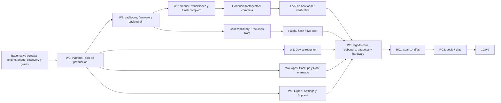

# PixelFlasher 10.0.0: plan de ejecución restante

## Propósito y fuente de verdad

Este documento convierte los 35 gates de publicación todavía abiertos de
`docs/modern-ui-parity.json` en un backlog ordenado por dependencias. No
reemplaza la matriz: el estado de una capacidad solo cambia cuando su
`exitCriteria` está demostrado y se actualiza la matriz junto con la evidencia.

El orden conserva las decisiones del plan maestro:

- React/TypeScript dentro de un único wxWebView persistente.
- wxPython limitado al host y a los selectores nativos.
- Ninguna operación fuera de `SafetyPolicy`, del planner y de un
  `OperationResult` explícito.
- Paridad completa antes de RC1; no se publicará una versión estable parcial.
- La versión fuente permanece en 9.2.2 hasta el tag de RC1.
- Los artefactos externos se obtienen bajo demanda, se verifican mediante
  manifiestos firmados y nunca se descargan desde el WebView.

El corte cuantitativo usa la matriz schema v2 vigente y el registro de comandos
del árbol de trabajo del 19 de julio de 2026.

Los identificadores G04 y G06 se conservan en la Wave 1 como checkpoints
cerrados para no renumerar las dependencias históricas; no forman parte de los
35 gates abiertos.

## Estado cuantitativo actual

| Medida | Estado | Criterio de cierre |
|---|---:|---|
| Capacidades inventariadas | 53 | El inventario continúa cubriendo menú, README, handlers y flujos dinámicos. |
| Gates de publicación | 52 | Los 52 deben quedar en `native`. |
| Gates cerrados | 17 (32,7 %) | Ya están en `native`; siguen sujetos a regresión empaquetada. |
| Gates abiertos | 35 (67,3 %) | 30 `partial`, 4 `missing` y 1 `blocked`. |
| Exclusiones de política | 1 | `flash.wipe_shortcut` permanece `policy_absent`; wipe solo existe dentro de un plan de flash confirmado. |
| Comandos registrados | 80 | Cada comando conservado debe tener owner, contrato, implementación y tipos Python/TypeScript concordantes. |
| Comandos expuestos e implementados | 75 (93,8 %) | No puede quedar ningún comando `not_implemented` en el artefacto final. |
| Comandos registrados no expuestos | 5 | Implementarlos o retirarlos mediante una decisión de contrato revisada antes de RC1. |
| Gates abiertos con alguna prueba citada | 31 | La referencia existente caracteriza solo el subconjunto actual; no implica que el gate esté cerrado. |
| Gates abiertos sin prueba citada | 4 | Deben recibir pruebas de backend, contrato, React y/o E2E antes de pasar a `native`. |
| Plataformas afectadas por cada gate abierto | 35 de 35 en las tres | Windows, macOS y Linux deben presentar la misma capacidad. |

Los 5 comandos todavía no expuestos son: `tools.adbShell`,
`tools.myTools`, `tools.piAnalysis`, `tools.pif` y `updates.check`.

Distribución de los 35 gates abiertos por riesgo:

| Riesgo | Gates |
|---|---:|
| `destructive` | 10 |
| `device_write` | 12 |
| `host_write` | 7 |
| `host_read` | 2 |
| `none` | 4 |

Los cuatro gates sin una prueba citada en la matriz son `navigation.about`,
`support.updates_help`, `root.pif` y `app.personal_tools`. Son deuda de caracterización prioritaria,
no candidatos a una excepción de cobertura.

## Reglas de ejecución de cada wave

Una wave puede comenzar cuando sus contratos de entrada, fixtures y activos
externos están disponibles. Las tareas dentro de una wave pueden ejecutarse en
paralelo salvo las dependencias indicadas en cada tabla.

Las dependencias de aprovisionamiento externo son gates de cierre, no bloqueos
artificiales para desarrollar un contrato con fakes y recursos inyectados. Por
ejemplo, Device puede avanzar sobre una instalación local ya validada de ADB;
no podrá declararse publicable hasta que el catálogo y los smokes de Platform
Tools de producción también estén cerrados.

Un gate solo se considera terminado cuando, en el mismo cambio:

1. El comando tiene esquema cerrado, owner, riesgo, estados válidos, timeout,
   planner, confirmación y postcondiciones en el registro canónico.
2. El backend revalida revisión, serial, modo y artefactos inmediatamente antes
   de ejecutar; no reconstruye estado desde React o wx.
3. La UI React cubre `SUCCESS`, `CANCELLED` y `FAILED`, conserva foco/estado y
   no delega en una ventana clásica.
4. Las pruebas negativas demuestran timeout, cancelación, desconexión, salida
   malformada y postcondición ausente o discrepante cuando apliquen.
5. Python y TypeScript se regeneran desde el mismo contrato, y el bundle de
   producción pasa el verificador de fronteras.
6. `docs/modern-ui-parity.json` cambia a `native` con evidencia concreta y la
   matriz Markdown se regenera o actualiza de forma concordante.
7. Se registra la auditoría de `upstream/main` al cerrar el hito correspondiente.

No se usará el porcentaje de gates como porcentaje de esfuerzo: firmware,
flashing, empaquetado y hardware concentran mucho más trabajo y riesgo que una
ruta de navegación.

## Wave 0: desbloqueos de producto, toolchain y shell

Objetivo: cerrar las dos decisiones que bloquean gran parte del trabajo
posterior. `platform_tools.setup` está en la ruta crítica de todas las
operaciones de dispositivo; `device.adb_shell` debe dejar de ser el único gate
`blocked` antes de retirar el legado.

| # | Gate y estado | Dependencias | Entrega ejecutable | Evidencia de salida |
|---|---|---|---|---|
| G01 | `platform_tools.setup` (`partial`) | Ninguna | Provisionar la clave pública y el catálogo Ed25519 de producción; completar manifests oficiales por OS/arquitectura, instalación atómica, rollback y activación transaccional. | Fakes de firma/hash/ETag/Range/redirect/rollback y smokes empaquetados en Windows x64/ARM64, macOS Intel/ARM y Linux/AppImage. Un build sin catálogo falla cerrado. |
| G02 | `device.adb_shell` (`blocked`) | `device.discovery`, G01 | Formalizar en el registro el contrato ya fijado por el plan maestro: terminal React con xterm.js, ConPTY en Windows, PTY en macOS/Linux y ejecución directa `adb -s SERIAL shell` con `shell=False`. Cerrar el PTY al cambiar serial, revisión o estado. | Pruebas de lifecycle, resize, stdin/stdout binarios, cancelación, desconexión, cambio de selección, redacción y axe; smokes de PTY real en las tres plataformas. |

Gate de la wave: G01 y G02 están `native`, no quedan binarios sin procedencia y
el shell arbitrario no comparte contrato con My Tools/Legacy Raw.

## Wave 1: cierre de Toolchain y Device

Objetivo: terminar el hito Device sobre la base ya nativa de discovery, reboot,
slots, wireless, logcat y push. Todas las mutaciones deben tener una
postcondición observada.

| # | Gate y estado | Dependencias | Entrega ejecutable | Evidencia de salida |
|---|---|---|---|---|
| G03 | `device.scrcpy` (`partial`, cadena técnica completada el 19-07-2026) | `device.discovery`; manifiesto externo | Entregado: instalador ZIP/TAR autenticado, extracción confinada, hash/arquitectura/versión/licencia/procedencia, activación y persistencia atómicas, opciones React tipadas, argv serial-bound y lifecycle cancelable. Pendiente: manifests Ed25519 y catálogo de producción. | Pruebas de firma/hash/arquitectura/versión, traversal, duplicados, cancelación, argv exacto y bridge sin rutas están verdes; faltan smokes de ventana/proceso empaquetados en cada plataforma. |
| G04 | `device.inspect` (`native`, cerrado el 19-07-2026) | `device.discovery`, G01 | Entregado: extracción A/B directa sin temporales, root efectivo probado, streaming de 64 MiB por slot, SHA-256 incremental y reconciliación exacta con el slot activo. | 19 pruebas del runner/scanner, 31 del servicio/engine y contrato público/React cerrado; timeout, cancelación, overflow, stderr, root ausente, plan forjado y discrepancia fallan cerrados. |
| G05 | `device.ota_diagnostics` (`partial`, observer idle entregado el 19-07-2026) | `device.discovery`, G01; fuente reproducible del runner | Entregado: status/preflight estricto y acotado, certificados, logs redacted y postcondición `ota_idle_state`. El observer consulta el binario de sistema por separado, limita/parsing estricto de la salida y distingue verified, mismatch y unverified. Los binarios opacos legacy no se promovieron al core moderno. Pendiente: runner mutante reproducible, cancel/reset y empaquetado. Sin reintentos automáticos tras mutación. | El status cubre argv serial-bound, revisión, estados/progreso desconocidos, duplicados, overflow y DTO cerrado. El observer cubre idle, descarga activa y salida hostil/no verificable; faltan pruebas del runner/hash/arquitectura, estado previo incompatible, cancelación antes/después de mutar, timeout y desconexión. |
| G06 | `app.device_manager` (`native`, cerrado el 19-07-2026) | `device.discovery` | Entregado: política versionada y persistente para pausar/reanudar scanning, alcance enabled/all, alias, enable/disable, remove, hotplug y selección múltiple, con migración idempotente y backup del roster 9.x. | Pruebas backend/contrato/React cubren add/remove/reconnect, pausa/reanudación, serial duplicado, ADB↔fastboot, selección desaparecida, fallo de persistencia y accesibilidad. |

Gate de la wave: G03 y G05 están `native`; G04 y G06 ya están cerrados. Toda transición o proceso externo
tiene cancelación y estado final comprobado; los ejecutables externos tienen
manifiesto y procedencia de producción.

## Wave 2: firmware, repositorios y recursos de root

Objetivo: crear una cadena cerrada desde catálogo o grant nativo hasta un
artefacto content-addressed y compatible. Esta wave alimenta Flash, Boot y Root
y por ello precede cualquier intento de cerrar esos gates.

| # | Gate y estado | Dependencias | Entrega ejecutable | Evidencia de salida |
|---|---|---|---|---|
| G07 | `firmware.downloads` (`partial`, cadena técnica entregada el 19-07-2026) | Catálogos/manifiestos externos | Entregado: catálogo backend de manifests Ed25519, IDs opacos, factory/OTA y canales stable/beta/canary, descarga cancelable con caché verificada, ETag/Range/redirect allow-list, SHA-256, inspección, persistencia `official` y selección final React. Pendiente: catálogo firmado de producción y smokes reales de fuentes oficiales. | Pruebas cubren scope/kind/firma hostil, ID desconocido, caché, cancelación, DTO sin URL/rutas y ciclo runtime hasta `FirmwareRepository`; faltan manifests caducados/reales y smokes empaquetados. |
| G08 | `firmware.select_stock` (`partial`, núcleo técnico entregado el 19-07-2026) | `native.file_dialogs`; G07 para selección oficial | Entregado: identificación factory/full OTA, procedencia `official`/`user_supplied`, recibo cerrado de hash/archivo/compatibilidad visible en React y rollback de la importación si falla la promoción revisionada. Pendiente: política criptográfica de firmas de paquete, retry manual y smokes empaquetados. | Cubierto factory, OTA, corrupto, producto equivocado, cancelación, DTO hostil y carrera post-import sin objetos parciales; faltan firma conocida/desconocida y smokes de artefactos reales. |
| G09 | `firmware.select_custom` (`native`, flujo dedicado cerrado el 19-07-2026) | `native.file_dialogs` | Entregado: controles React separados para factory/OTA y custom ROM, grant opaco de lectura, intención `expectedKind` validada en bridge/backend y rechazo explícito si el paquete no corresponde; la inspección detecta direct images o `payload.bin`. | Cubierto grant/payload hostil, intención stock/custom equivocada, ZIP traversal, symlink, bomba, estructura ambigua, producto incompatible, cancelación y recibo cerrado. |
| G10 | `firmware.process_stock` (`partial`, cadena transaccional entregada el 19-07-2026) | G08 | Entregado: diagnóstico cerrado, extracción confinada, promoción stock a `BootRepository` con hash de firmware/codenames y rollback coordinado de registros en memoria/SQLite, objetos content-addressed y salida extraída. Pendiente: retry manual y smokes empaquetados. | Golden factory/OTA, formato boot, procedencia y fallos/cancelaciones están cubiertos; carreras de revisión prueban que no quedan objetos firmware/boot parciales. Faltan smokes en las tres plataformas. |
| G11 | `firmware.process_custom` (`native`, evidencia runtime cerrada el 19-07-2026) | G09 para UX dedicada | Entregado: direct images y `payload.bin` mediante parser acotado y extractor empaquetado/verificado, compatibilidad por codename, hashes por operación/salida, extracción confinada, cancelación y registro persistente de firmware/boot con procedencia. | Cubierto payload válido custom/OTA, truncado, manifiesto/extent/operación inválidos, hash incorrecto, codename equivocado, cancelación, output extra, swap TOCTOU, límites y ciclo runtime hasta `BootRepository`. |
| G12 | `boot.inventory` (`native`, cerrado el 19-07-2026) | G10 | Entregado: `boot.delete` revisionado con DTO cerrado, política de seguridad, rechazo de selección canónica y operación activa, preservación de objetos SHA-256 compartidos, confirmación React accesible y resultado explícito cuando el registro se confirma pero el unlink queda diferido. Un recolector de arranque acotado elimina únicamente objetos canónicos sin propietario SQLite y conserva nombres desconocidos, enlaces y objetos vivos. | Cubiertos delete no compartido, compartido, canónico, operación activa, revisión obsoleta, fallo de unlink posterior al commit, contrato host-path-free, recorrido React por ID opaco, límite del recolector y recuperación automática en reinicio. |
| G13 | `root.apps` (`partial`, cadena técnica entregada el 19-07-2026) | G01; catálogo externo | Entregado: catálogo backend Ed25519 para canales stable/beta/canary y los siete proveedores, IDs opacos, descarga/caché verificada, validación de package ID, firmantes, hash y arquitectura, promoción revisionada al inventario y UX React de catálogo/descarga/instalación. Pendiente: manifests de producción, smokes contra releases reales y runners empaquetados de G20. | Cubiertos los siete providers, scope/canal, firma de manifest, package/signer mismatch, ID desconocido, caché, cancelación, DTO sin URL/ruta, rollback por carrera de revisión y flujo engine hasta inventario local. |

Orden interno: G07→G08→G10, G09→G11 y G10→G12. G13 puede ejecutarse
en paralelo, pero debe terminar antes de `boot.patch`.

Gate de la wave: G07–G13 están `native`; todo firmware, boot image, APK y
runner tiene hash, procedencia, compatibilidad y transacción verificables.

## Wave 3: Flash, Boot, Root patch y bootloader

Objetivo: cerrar la ruta crítica de mutación. Antes de implementar modos
individuales se creará un coordinador común de transiciones ADB, bootloader,
fastbootd, recovery y sideload, junto con observers de reconexión, slot,
bootloader, build, hashes y `boot_completed`.

| # | Gate y estado | Dependencias | Entrega ejecutable | Evidencia de salida |
|---|---|---|---|---|
| G14 | `flash.advanced_options` (`partial`, productor downgrade, bridge y matriz backend ampliados el 19-07-2026) | `device.discovery`, G10, G11 | Entregado: ambos slots y `inactive` se resuelven desde estado backend; factory/custom/OTA, wipe y opciones incompatibles fallan cerrado. `DowngradePatchService` inspecciona y reescribe AVB sin shell, verifica SPL/fingerprint y registra `downgrade:boot` ligado al hash de firmware; el planner sustituye exclusivamente ese artefacto en modos factory preserve-data. `tools.avb` usa contrato cerrado, grant nativo o SPL exclusivo y React Expert sin rutas del host. React también impide verification-off, downgrade con wipe/OTA y `temporaryRoot + noReboot`. Pendiente: smokes empaquetados/hardware. | Golden/property tests cubren slots, modo×firmware, wipe encubierto, interlocks, artefacto ausente/manipulado, AVB real con la clave bundle, bridge/grants/React y uso exacto del boot downgrade. Faltan E2E WebView y hardware. |
| G15 | `flash.mode_dry_run` (`native`, cerrado el 19-07-2026) | `device.discovery`, G10, G11, G14 | Factory, OTA y custom compilan el argv exacto, conservan fingerprint estable y TTL de cinco minutos, no solicitan confirmación y ejecutan con cero procesos. La selección múltiple se conserva de React al core y produce un `OperationPreviewBatch` inmutable, no ejecutable y sin rutas del host. | Pruebas cubren los tres tipos, igualdad de fingerprint, expiración, ausencia de interacción/proceso, preservación del estado canónico, scope batch y proyección pública cerrada de todos los dispositivos. |
| G16 | `flash.mode_keep_data` (`partial`, batch y fastbootd conectados el 19-07-2026) | G01, G10, G14; coordinador de transiciones | Entregado: preview y confirmación batch ligados al fingerprint, apertura del lifecycle en el último boundary validado y ejecución secuencial fail-fast mediante `OperationRunner.execute_batch`. El planner separa particiones bootloader/fastbootd, transiciona con `reboot fastboot|bootloader` y espera el dispositivo antes de continuar. Pendiente: resto de interacciones de opciones y smokes empaquetados/hardware. | El runner cubre éxito, fallo, cancelación antes/después de mutar, desconexión, revalidación y replan obligatorio. Golden tests cubren orden exacto desde fastboot y fastbootd, seriales, particiones y retorno a bootloader para operaciones incompatibles; faltan smokes de hardware, slot, build y hash. |
| G17 | `flash.mode_wipe` (`partial`, contrato reforzado completado el 19-07-2026) | G01, G10, G14; coordinador de transiciones | Entregado: wipe existe únicamente dentro del plan inmutable de flash; el planner rechaza wipe encubierto en otros modos, exige `WIPE <serial-6>` para un dispositivo y `WIPE <n> <fingerprint-8>` para batch. `OperationBatch` rechaza mezclar preserve/wipe. Pendiente: smokes empaquetados y hardware. | Pruebas directas cubren ausencia de shortcut, confirmación/nonce/token exactos, argv `fastboot -w`, cancelación antes de mutar sin procesos, timeout posterior como `FAILED/outcome_unknown` y confirmación batch ligada al fingerprint. |
| G18 | `flash.mode_ota` (`partial`, transición backend entregada el 19-07-2026) | G01, G10, G14; coordinador de recovery/sideload | Entregado: el planner acepta ADB, recovery o sideload y compila `reboot sideload → wait-for-sideload → sideload` sin shell. Cuando se solicita reboot final exige slot activo conocido, liga el plan al slot inactivo y verifica reconexión ADB, `boot_completed`, build y slot resultante. Pendiente: progreso porcentual, smokes empaquetados y hardware. | Pruebas cubren argv exacto desde los tres estados, firmware/hash incompatibles, slot desconocido, reboot/no-reboot y postcondiciones tipadas; el runner ya convierte timeout/desconexión tras transición en `outcome_unknown`. Faltan porcentaje real y validación hardware. |
| G19 | `flash.execute` (`partial`, runner y evidencia stock conectados el 19-07-2026) | G11, G14–G18 | Entregado: `OperationPlan`/`OperationBatch` se revalidan, ejecutan secuencialmente y fallan rápido para factory/custom/OTA. OTA y fastbootd tienen transiciones backend y observers de build/slot/hash. Un factory stock seguro, completo y verificado en ambos slots produce evidencia revisionada por dispositivo para relock. Pendiente: E2E WebView y hardware empaquetado. | La matriz fake cubre success/cancel/failed/unknown, serial/revisión/hash/mode mismatch, batches, transiciones y producción/no-producción de evidencia; faltan hardware y E2E empaquetado. |
| G20 | `boot.patch` (`partial`) | G12, G13; APKs oficiales y runners propios | Empaquetar runners propios y obtener bajo demanda providers reales verificados, seleccionar runner por arquitectura/KMI y registrar toda salida en `BootRepository`; mantener el superkey APatch como grant opaco de un uso. | Golden patch por los siete sabores, KMI incompatible, firma/hash, secreto ausente/reflejado, cancelación y artefacto final verificado. |
| G21 | `boot.flash` (`partial`, postcondición backend cerrada el 19-07-2026) | G01, G12; observer | Entregado: el plan liga serial, revisión, partición, slot y SHA-256; después de `fastboot flash`, el observer de producción exige un readback acotado de la partición slot-qualified y compara su hash. Evidencia ausente o discrepante nunca produce éxito. Pendiente: smokes empaquetados y hardware. | Las pruebas de integración cubren slot `a`, readback verificado, hash distinto y `fastboot fetch` no disponible; golden tests cubren `boot`/`init_boot`, locked bootloader, cancelación, timeout y disconnect. Faltan slots/particiones reales en hardware. |
| G22 | `boot.live` (`partial`, postcondición backend cerrada el 19-07-2026) | G01, G12; observer | Entregado: aceptar `fastboot boot` no basta; el observer de producción exige reconexión en ADB y `sys.boot_completed=1`, con resultados tipados para discrepancia o ausencia de evidencia. Pendiente: smokes empaquetados y hardware. | Las pruebas de integración cubren boot completo, `boot_completed=0` y propiedad no observable; golden tests cubren timeout, desconexión, cancelación, selección y revisión. Faltan recovery inesperado y validación real en las tres plataformas. |
| G23 | `bootloader.manage` (`partial`, cadena de evidencia conectada el 19-07-2026) | G01, G19 | Entregado: unlock/lock usan argv serial-bound, confirmación `UNLOCK|LOCK <serial-6>` y observer de estado final. Lock requiere y consume evidencia backend de un uso, ligada a serial, codename, build, firmware, plan, particiones, ambos slots, resultado y revisión; cualquier cambio la invalida. Pendiente: smokes empaquetados y hardware locked/unlocked. | Pruebas cubren evidencia ausente/caducada/reutilizada/mismatch, productor factory completo, no-producción para planes parciales, confirmación exacta, consumo y estado final tipado; faltan hardware y firma empaquetada. |

Gate de la wave: G14–G23 están `native`; factory, OTA y custom completan
plan→confirmación→ejecución→observación sin legacy, y ninguna ausencia de
prueba puede convertirse en `SUCCESS`.

## Wave 4: Apps, Backups y Root avanzado

Objetivo: retirar los managers wx de Apps, Backups y Root y cubrir todas sus
acciones con contratos estrechos. Los flujos que requieren root deben detectar
capacidad y fallar sin mutar si no está disponible.

| # | Gate y estado | Dependencias | Entrega ejecutable | Evidencia de salida |
|---|---|---|---|---|
| G24 | `apps.package_manager` (`partial`, paridad técnica cerrada el 19-07-2026) | `device.discovery`, G01 | Entregado: listing, enable/disable, uninstall con keep-data, clear-data, force-stop, launch, permisos tipados, denylist Magisk, SU allow/deny/revoke y export APK desde React. Export usa grant write-once, obtiene la ruta desde `pm path`, limita orígenes, realiza staging local/remoto, verifica identidad/hash, publica atómicamente y limpia ambos staging. Las mutaciones root exigen root; SU liga package↔UID y el observer vuelve a consultar Magisk. Pendiente: smokes empaquetados en las tres plataformas. | Cubiertos package IDs hostiles, grants/replay/rutas arbitrarias, UID/duración/flags, raíz ausente, argv/SQL exactos, mismatch Magisk, identidad/hash/limpieza/export hostil, DTO público cerrado, RTL y refresh success-gated. Faltan únicamente smokes empaquetados para promover el gate a `native`. |
| G25 | `apps.install_apk` (`partial`, paridad técnica cerrada el 19-07-2026) | G24, `native.file_dialogs` | Entregado: Play Store ownership es un booleano React tipado, compila `-i com.android.vending` solo en backend y exige que Android vuelva a informar esa fuente; se conservan los seis flags allow-listed, el grant opaco de un uso y el refresh success-gated. Pendiente: smokes empaquetados en las tres plataformas. | Firma/package ID/SDK, ownership disponible/ausente/discrepante, flags exactos, grant expirado/un uso, postcondición independiente y estado de inventario posterior están cubiertos; faltan únicamente smokes empaquetados. |
| G26 | `backups.magisk` (`partial`, paridad técnica cerrada el 19-07-2026) | `device.discovery`, G01, `native.file_dialogs` | Entregado: list acotado, import desde grant opaco y delete con confirmación serial/hash, scripts de dispositivo confinados, SHA-1/SHA-256, limpieza de staging y postcondición independiente `verified`/`absent`. El import ejecuta las migraciones canónicas de Magisk y nunca transporta rutas por el bridge. Pendiente: smokes empaquetados y hardware root real en las tres plataformas. | Cubiertos inventarios corruptos, duplicados, malformados y sobredimensionados; root/modo ausentes; argv exacto; TOCTOU; fallo de postcondición; DTO cerrado; refresh success-gated; grant ligado a propósito; RTL y axe. Faltan smokes empaquetados y hardware para promover a `native`. |
| G27 | `navigation.backups` (`partial`, paridad técnica cerrada el 19-07-2026) | G26 | Entregado: una única ruta React para raw y Magisk con create/restore/import/list/delete, estados loading/error/empty, integridad visible y confirmaciones reforzadas, sin diálogo wx ni ruta arbitraria. Pendiente: E2E del wxWebView empaquetado y recorridos de teclado/foco en los tres sistemas. | RTL y axe demuestran grants opacos, inventario corrupto visible, confirmación exacta y refresh solo tras `SUCCESS`; faltan smokes reales WebView/hardware antes de `native`. |
| G28 | `root.modules` (`partial`, inventario tipado entregado el 19-07-2026) | `device.discovery`, G01, `native.file_dialogs` | Entregado: inventario acotado con ID, nombre, versión/versionCode, autor, descripción, estado y presencia validada de metadata update; `module.prop` se transporta codificado y se rechaza cerrado. React nunca recibe la URL. Install/enable/disable/remove vuelven a leer el dispositivo en la revisión resultante solo tras `SUCCESS`; `FAILED`/`CANCELLED` no inventan estado. Pendiente: descarga/verificación backend del update y el resto de ajustes root. | Cubiertos registros/URLs/base64 hostiles, duplicados, límites, DTO público cerrado sin URL/ruta, ZIP módulo hostil, root ausente, confirmación, timeout y postcondiciones; RTL demuestra estados/versiones y refresh revisionado. Falta ejecutar el update verificado y migrar ajustes root. |
| G29 | `root.data_adb` (`partial`, paridad técnica entregada el 19-07-2026) | `device.discovery`, G01, `native.file_dialogs` | Entregado: backup, restore y clear modernos sobre grants opacos; contenedor `.pfdataadb` cerrado con manifiesto, SHA-256 y payload tar confinado; staging backend, publicación atómica, limpieza, confirmaciones exactas y resultados verificados por runner/observer. React no recibe rutas y las tres operaciones están ligadas a serial y revisión. Pendiente: smokes empaquetados, hardware root real, cancelación/desconexión después de mutar y completar variantes tar hostiles. | Cubiertos root ausente, grants de un uso, traversal, enlaces, miembros extra, hash corrupto, firmware incompatible, confirmación exacta, DTO público cerrado, postcondiciones y axe. Faltan absolute/backslash, hardlink/special/sparse/duplicate/oversize y recorridos reales de cancelación/desconexión. |
| G30 | `root.pif` (`missing`) | `device.discovery`, G01 | Implementar PIF/TargetedFix y PI Analysis con DTOs redacted; separar keybox como herramienta experta y no guardar secretos. | JSON hostil, perfiles/versiones, root ausente, identidad/secretos ausentes de snapshot/log/repr y pruebas E2E de análisis. |
| G31 | `root.recovery_tools` (`partial`, backend y React entregados el 19-07-2026) | `device.discovery`, G01 | Entregado: Start Shizuku usa únicamente ubicaciones backend-owned, confina la ruta derivada de Package Manager y exige observar el proceso; SOS solo crea marcadores `disable`, exige `SOS <serial-6>` y observa que no quede ningún módulo habilitado. Ambos comandos son serial/revision-bound, `shell=False` en host y tienen DTO público cerrado. Pendiente: smokes con Shizuku real, estados de arranque/bootloop y hardware rooted/unrooted. | Cubiertos argv, aliases, modo/root incorrectos, confirmación, proyección pública cerrada, estado agregado verificado y mismatch, además de RTL para la frase reforzada y refresh canónico. Faltan cancelación/desconexión E2E y matriz de hardware. |

Gate de la wave: G24–G31 están `native`; no quedan capacidades parciales ni
diálogos clásicos en Apps, Root o Backups.

## Wave 5: Settings, Expert, Support y cierre de navegación

Objetivo: cerrar las capacidades de host y Expert, completar la migración 9.x
y hacer que todas las rutas visibles representen capacidad real.

| # | Gate y estado | Dependencias | Entrega ejecutable | Evidencia de salida |
|---|---|---|---|---|
| G32 | `settings.application` (`partial`) | Ninguna | Completar schema v2 y todas las preferencias 9.x soportadas, incluido Expert Mode host-persisted; backup, migración idempotente, escritura atómica y mirrors 9.x para toda la serie 10.x. | Property tests de migración repetida/corrupta/interrumpida, round-trip, rollback y permisos en los tres OS. |
| G33 | `navigation.settings` (`partial`) | G32 | Exponer cada preferencia versionada en React, con validación, deshacer/error y disclosure Expert sin leer widgets. | RTL/axe, teclado/foco, seis idiomas, zoom 200 %, temas y E2E de persistencia/reinicio. |
| G34 | `app.preferences_shell` (`partial`) | G32 | Completar layout de toolbar, idioma, carpetas, consola redacted y exit; el host abre carpetas/enlaces y controla lifecycle. | Reinicio/persistencia, rutas inexistentes, consola sin secretos, cierre con operación activa y smokes de chrome nativo. |
| G35 | `support.package` (`partial`) | `native.file_dialogs`; clave RSA externa | Provisionar la clave receptora de producción y validar lectura v1/escritura v2, SQLite saneado, allow-list, límites, redacción y cifrado AES-256-GCM/RSA-OAEP. | Interoperabilidad empaquetada, clave errónea, archivo enorme, symlink, secretos sembrados, manifiesto/hash y ausencia de subida automática. |
| G36 | `support.updates_help` (`missing`) | G32; manifiesto de updates externo | Implementar `updates.check` en backend, manual y automático opt-in; completar Help, release notes, support links y apertura en chrome nativo. | CSP `connect-src 'none'`, manifiesto firmado/caducado/rollback, offline, opt-in, URL allow-list y axe. |
| G37 | `navigation.about` (`missing`) | G36 para experiencia completa | Crear About/Help accesible con versión derivada del paquete/tag, licencia, proyecto, updates y soporte. | Versiones 9.2.2/dev/RC derivadas correctamente, licencias empaquetadas, teclado/lector de pantalla y cero red WebView. |
| G38 | `partitions.manage` (`partial`) | `device.discovery`, G01, `native.file_dialogs` | Añadir verificación device-side tras write/erase, progreso acotado y retry solo manual; conservar confirmación `ERASE <partition> <serial-6>`. | Read/write/erase por slot, hash remoto cuando sea posible, partición ausente, desconexión y resultado desconocido sin retry automático. |
| G39 | `dev.tools` (`partial`, flujos AVB downgrade, XML binario y keybox nativos entregados el 19-07-2026) | `native.file_dialogs` | Provisionar la evidencia de revocación keybox firmada para producción y cerrar smokes AVB/XML/keybox empaquetados y hardware donde aplique. | AVB cubre SPL, fingerprint, hash, cancelación, postcondición, bundle real, grant opaco, bridge y React. XML usa parser propio sin shell con límites estrictos y proyección pública cerrada. Keybox valida estructura, claves, cadenas, fechas y revocación con límites, grants ligados al inode y sin exponer DeviceID, claves o certificados; sin snapshot firmado devuelve `unverified`. Faltan el snapshot Ed25519 de producción, fuzz ampliado de certificados/imágenes y validación empaquetada. |
| G40 | `app.personal_tools` (`missing`) | G32, `native.file_dialogs` | Implementar `MyToolSpec` con argv tipado y `shell=False`; aislar Legacy Raw en Expert Mode con permiso persistente por herramienta y confirmación reforzada por ejecución. | Allow-list de cwd/env, sin elevación/redirecciones implícitas, comando exacto visible, permisos/revocación y fakes hostiles en cada OS. |
| G41 | `navigation.tools` (`partial`) | G03, capacidades ya nativas `device.wireless`/`device.logs`/`device.push_files`, G35, G38–G40 | Convertir Tools en un catálogo de capacidades reales: estados disponibles/no disponibles, owner, progreso, retry y resultados; sin previews ni acciones duplicadas. | RTL/axe y E2E de cada tarjeta; no aparece una herramienta sin contrato implementado ni una ruta que abra UI clásica. |

Gate de la wave: G32–G41 están `native`. Al terminar, los 52 gates de
publicación deben estar `native` y la única capacidad no nativa debe ser
`flash.wipe_shortcut=policy_absent`.

## Wave 6: retirada final, calidad y candidato RC1

Esta wave no agrega gates de paridad: demuestra que los 35 gates restantes, una vez cerrados, son
publicables y completa los requisitos transversales del plan maestro.

### Producto y frontera del artefacto

- Dividir el frontend por rutas/features sin perder el documento persistente,
  el foco o el estado; prohibir `SetPage()` y `mockBridge` en producción.
- Terminar tokens claro/oscuro/alto contraste/movimiento reducido, responsive,
  zoom 200 % y export gettext de los seis idiomas sin cadenas visibles fuera de
  catálogo.
- Retirar `Main.py`, frames ocultos, managers/diálogos wx, delegates `_on_*`,
  lecturas de widgets, globals de sesión, previews y runtime/pf_modules legacy
  del artefacto moderno.
- Hacer fallar CI si el core importa wx/UI, si el arranque moderno importa
  `Main`, si un comando carece de implementación o si una acción evita
  `SafetyPolicy`/planner/runner.

### Pruebas y cobertura

- Ejecutar pytest sobre unittest, Ruff y Pyright estricto del core.
- Alcanzar 100 % de ramas en `SafetyPolicy`, planner, observer y command
  registry; 90 % como mínimo en servicios/políticas y 80 % global, medido por
  separado en Python y frontend.
- Cubrir con ADB/Fastboot falsos y stateful seriales, argv, stdin, timeouts,
  desconexiones, slots, modos, bootloader y postcondiciones.
- Añadir property/fuzz para bridge, grants, ZIP/payload, manifests, paths,
  confirmaciones y DTOs públicos.
- Completar Vitest, React Testing Library, axe, Playwright y smokes del wxWebView
  real. Ejecutar regresión visual en dos temas, alto contraste, seis idiomas,
  resoluciones soportadas y zoom 200 %.
- Validar manualmente NVDA, VoiceOver y Orca; eliminar `NO_AT_BRIDGE=1`.

### Empaquetado, seguridad y hardware

- Arrancar el ejecutable real en Windows x64/ARM64, macOS Intel/Apple Silicon,
  Ubuntu 22.04/24.04, AppImage, X11/Xvfb y Wayland/Weston; comprobar WebView,
  assets, fake ADB y arquitectura.
- Fijar Actions por SHA y dependencias por hashes/lockfiles. Generar SBOM
  CycloneDX/SPDX, provenance/attestation, manifiestos y SHA-256.
- Verificar Authenticode; Developer ID, hardened runtime, notarización, staple
  y `spctl`; y checksums firmados de Linux/AppImage.
- Ejecutar hardware en un Pixel A/B antiguo, Tensor con `init_boot` y un equipo
  actual con Android 17; locked/unlocked, USB/wireless, factory/OTA/custom,
  recovery/sideload y desconexión durante operación.
- Repetir auditoría upstream sobre el SHA exacto del freeze, resolver cada
  commit y adjuntar el informe. Cero P0/P1 abiertos.

Gate de la wave: matriz verde y todo comando requerido implementado y
concordante. Si un ID resulta obsoleto, debe eliminarse de registro, matriz y
tipos mediante una migración de contrato revisada; nunca puede quedar como
`not_implemented`. Además: cobertura alcanzada, frontera legacy limpia, matriz
empaquetada/hardware/accesibilidad verde, firmas/SBOM/provenance verificadas y
auditoría upstream cerrada. Solo entonces se crea el tag protegido
`v10.0.0-rc.1`.

## Wave 7: RC1, RC2 y 10.0.0

1. **RC1:** construir, probar y firmar todo en el mismo run del tag
   `v10.0.0-rc.1`. Conservar evidencia y estabilizar durante al menos 14 días.
2. **Correcciones RC1:** aceptar solo defectos observados, con regresión y
   auditoría de impacto. Cualquier cambio de dependencia se trata como cambio
   de código.
3. **RC2:** reconstrucción limpia desde `v10.0.0-rc.2`, misma matriz completa,
   firmas, hardware y empaquetado. Soak mínimo de siete días.
4. **RC adicional:** cualquier cambio de código o dependencia posterior obliga
   a RC3 (o superior) y reinicia el soak aplicable.
5. **GA:** crear `v10.0.0` sobre el mismo commit y lockfiles del último RC
   aprobado. Solo pueden variar metadata derivada del tag, firmas y timestamps;
   se compara el payload desempaquetado excluyendo esos campos.

Los 21 días de soak de RC1+RC2 son un mínimo posterior a terminar ingeniería;
no deben solaparse con implementación de paridad.

## Ruta crítica y trabajo paralelo

La ruta crítica técnica es:

`platform_tools.setup` → `firmware.downloads/select/process` →
`flash.advanced_options` → modos de flash → `flash.execute` → evidencia
stock → `bootloader.manage` → hardening/empaquetado/hardware → RC1 → RC2.

Tres carriles pueden avanzar en paralelo sin sacar trabajo de esa ruta:

- Device: Scrcpy, inspect, OTA diagnostics y Device Manager.
- Producto: Apps, Backups y Root avanzado después de Toolchain.
- Host/Expert: Settings, Support y herramientas, cerrando navegación al final.

Todos convergen antes de W6; ninguna rama parcial puede aplazarse a una versión
estable posterior.

## Activos externos y decisiones que deben aprovisionarse

| Activo/decisión | Necesario antes de | Condición de aceptación |
|---|---|---|
| Clave pública y manifests Ed25519 de producción | G01, G03, G07, G13 | Public key fijada en binario, doble clave durante rotación, URL/licencia/procedencia/SHA-256/tamaño/expiración y fixtures de firma negativa. |
| Platform Tools oficiales por OS/arquitectura | G01 | Fuente oficial, hashes y versiones fijadas; licencia incluida; instalación y rollback probados. |
| Catálogos oficiales de factory/OTA/beta/canary | G07 | Parser backend versionado, snapshots de prueba, política de expiración y sin scraping/red WebView. |
| Scrcpy oficial por OS/arquitectura | G03 | Versión compatible, licencia, hash, discovery y lifecycle empaquetado. |
| APKs oficiales y runners propios para siete sabores de patch | G13/G20 | APKs bajo demanda con package ID/firma/hash y procedencia/licencia; runners propios reproducibles incluidos en el paquete con arquitectura/KMI declarados. |
| Fuente reproducible del runner de cancel/reset OTA | G05 | Procedencia auditable, arquitectura declarada, hash fijado y postcondición idle demostrable; no se admite el binario opaco legacy. |
| Clave pública RSA receptora de Support Package v2 | G35 | Inyección de producción reproducible, rotación documentada y prueba de descifrado interoperable. |
| Manifiesto/canal de updates | G36 | Firmado, anti-rollback, opt-in para checks automáticos y rutas de ayuda disponibles offline. |
| Credenciales de firma/publicación | W6 | Authenticode, Apple Developer ID/notarización y clave de checksums Linux disponibles solo en CI protegido. |
| Runners CI y laboratorio hardware | W6/RC1 | Windows ARM nativo, macOS Intel/ARM, Linux X11/Wayland/AppImage y los tres perfiles Pixel definidos por el plan. |

La ausencia de cualquiera de estos activos mantiene el gate correspondiente
abierto; no se sustituirá por una clave, APK, runner o prueba provisional en el
artefacto RC.

## Control de avance y evidencia por cierre

Al cerrar cada wave se adjuntará un informe reproducible con:

- SHA de la rama y SHA auditado de `upstream/main`.
- Diff de los gates afectados y suma de estados que continúa dando 53.
- Diff del command registry y tipos TypeScript generados.
- Pruebas dirigidas por gate, suites completas y cobertura Python/frontend.
- Build de producción y verificador de ausencia de mocks/legacy.
- Resultados por plataforma; desde W3, resultados fake-device y hardware que
  correspondan.
- Activos externos usados con versión, licencia, procedencia, firma y hash.
- Riesgos residuales, defectos P0/P1 y decisión explícita de avanzar o no.

La secuencia de recuentos esperada es 40 → 38 → 35 → 28 → 18 → 10 →
0 gates abiertos al terminar W5. W6 y W7 no reducen el recuento: convierten la
paridad completa en un candidato firmado, validado y finalmente publicable.
