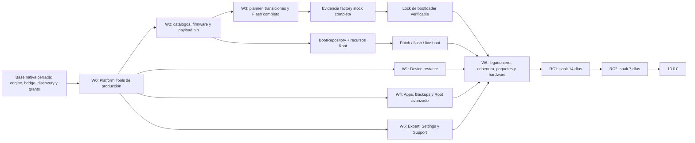

# PixelFlasher 10.0.0: plan de ejecución restante

## Propósito y fuente de verdad

Este documento convierte los 41 gates de publicación abiertos de
`docs/modern-ui-parity.json` en un backlog ordenado por dependencias. No
reemplaza la matriz: el estado de una capacidad solo cambia cuando su
`exitCriteria` está demostrado y se actualiza la matriz junto con la evidencia.

El orden conserva las decisiones del plan maestro:

- React/TypeScript dentro de un único wxWebView persistente.
- wxPython limitado al host y a los selectores nativos.
- Ninguna operación fuera de `SafetyPolicy`, del planner y de un
  `OperationResult` explícito.
- Paridad completa antes de RC1; no se publicará una versión estable parcial.
- La versión fuente permanece en 9.2.2 hasta el tag de RC1.
- Los artefactos externos se obtienen bajo demanda, se verifican mediante
  manifiestos firmados y nunca se descargan desde el WebView.

El corte cuantitativo usa la matriz schema v2 vigente y el registro de comandos
del árbol de trabajo del 19 de julio de 2026.

## Estado cuantitativo actual

| Medida | Estado | Criterio de cierre |
|---|---:|---|
| Capacidades inventariadas | 53 | El inventario continúa cubriendo menú, README, handlers y flujos dinámicos. |
| Gates de publicación | 52 | Los 52 deben quedar en `native`. |
| Gates cerrados | 11 (21,2 %) | Ya están en `native`; siguen sujetos a regresión empaquetada. |
| Gates abiertos | 41 (78,8 %) | 31 `partial`, 9 `missing` y 1 `blocked`. |
| Exclusiones de política | 1 | `flash.wipe_shortcut` permanece `policy_absent`; wipe solo existe dentro de un plan de flash confirmado. |
| Comandos registrados | 68 | Cada comando conservado debe tener owner, contrato, implementación y tipos Python/TypeScript concordantes. |
| Comandos expuestos e implementados | 52 (76,5 %) | No puede quedar ningún comando `not_implemented` en el artefacto final. |
| Comandos registrados no expuestos | 16 | Implementarlos o retirarlos mediante una decisión de contrato revisada antes de RC1. |
| Gates abiertos con alguna prueba citada | 33 | La referencia existente caracteriza solo el subconjunto actual; no implica que el gate esté cerrado. |
| Gates abiertos sin prueba citada | 8 | Deben recibir pruebas de backend, contrato, React y/o E2E antes de pasar a `native`. |
| Plataformas afectadas por cada gate abierto | 41 de 41 en las tres | Windows, macOS y Linux deben presentar la misma capacidad. |

Los 16 comandos todavía no expuestos son: `backups.delete`, `backups.list`,
`firmware.catalog.refresh`, `firmware.pick`, `firmware.pickCustomRom`,
`tools.adbShell`, `tools.avb`, `tools.dataAdb`, `tools.keybox`, `tools.myTools`,
`tools.piAnalysis`, `tools.pif`, `tools.shizuku`, `tools.sos`, `tools.xml` y
`updates.check`.

Distribución de los 41 gates abiertos por riesgo:

| Riesgo | Gates |
|---|---:|
| `destructive` | 10 |
| `device_write` | 13 |
| `device_read` | 1 |
| `host_write` | 10 |
| `host_read` | 3 |
| `none` | 4 |

Los ocho gates sin una prueba citada en la matriz son `navigation.about`,
`support.updates_help`, `root.data_adb`, `root.pif`, `root.recovery_tools`,
`dev.tools`, `app.personal_tools` y `app.device_manager`. Son deuda de
caracterización prioritaria, no candidatos a una excepción de cobertura.

## Reglas de ejecución de cada wave

Una wave puede comenzar cuando sus contratos de entrada, fixtures y activos
externos están disponibles. Las tareas dentro de una wave pueden ejecutarse en
paralelo salvo las dependencias indicadas en cada tabla.

Las dependencias de aprovisionamiento externo son gates de cierre, no bloqueos
artificiales para desarrollar un contrato con fakes y recursos inyectados. Por
ejemplo, Device puede avanzar sobre una instalación local ya validada de ADB;
no podrá declararse publicable hasta que el catálogo y los smokes de Platform
Tools de producción también estén cerrados.

Un gate solo se considera terminado cuando, en el mismo cambio:

1. El comando tiene esquema cerrado, owner, riesgo, estados válidos, timeout,
   planner, confirmación y postcondiciones en el registro canónico.
2. El backend revalida revisión, serial, modo y artefactos inmediatamente antes
   de ejecutar; no reconstruye estado desde React o wx.
3. La UI React cubre `SUCCESS`, `CANCELLED` y `FAILED`, conserva foco/estado y
   no delega en una ventana clásica.
4. Las pruebas negativas demuestran timeout, cancelación, desconexión, salida
   malformada y postcondición ausente o discrepante cuando apliquen.
5. Python y TypeScript se regeneran desde el mismo contrato, y el bundle de
   producción pasa el verificador de fronteras.
6. `docs/modern-ui-parity.json` cambia a `native` con evidencia concreta y la
   matriz Markdown se regenera o actualiza de forma concordante.
7. Se registra la auditoría de `upstream/main` al cerrar el hito correspondiente.

No se usará el porcentaje de gates como porcentaje de esfuerzo: firmware,
flashing, empaquetado y hardware concentran mucho más trabajo y riesgo que una
ruta de navegación.

## Wave 0: desbloqueos de producto, toolchain y shell

Objetivo: cerrar las dos decisiones que bloquean gran parte del trabajo
posterior. `platform_tools.setup` está en la ruta crítica de todas las
operaciones de dispositivo; `device.adb_shell` debe dejar de ser el único gate
`blocked` antes de retirar el legado.

| # | Gate y estado | Dependencias | Entrega ejecutable | Evidencia de salida |
|---|---|---|---|---|
| G01 | `platform_tools.setup` (`partial`) | Ninguna | Provisionar la clave pública y el catálogo Ed25519 de producción; completar manifests oficiales por OS/arquitectura, instalación atómica, rollback y activación transaccional. | Fakes de firma/hash/ETag/Range/redirect/rollback y smokes empaquetados en Windows x64/ARM64, macOS Intel/ARM y Linux/AppImage. Un build sin catálogo falla cerrado. |
| G02 | `device.adb_shell` (`blocked`) | `device.discovery`, G01 | Formalizar en el registro el contrato ya fijado por el plan maestro: terminal React con xterm.js, ConPTY en Windows, PTY en macOS/Linux y ejecución directa `adb -s SERIAL shell` con `shell=False`. Cerrar el PTY al cambiar serial, revisión o estado. | Pruebas de lifecycle, resize, stdin/stdout binarios, cancelación, desconexión, cambio de selección, redacción y axe; smokes de PTY real en las tres plataformas. |

Gate de la wave: G01 y G02 están `native`, no quedan binarios sin procedencia y
el shell arbitrario no comparte contrato con My Tools/Legacy Raw.

## Wave 1: cierre de Toolchain y Device

Objetivo: terminar el hito Device sobre la base ya nativa de discovery, reboot,
slots, wireless, logcat y push. Todas las mutaciones deben tener una
postcondición observada.

| # | Gate y estado | Dependencias | Entrega ejecutable | Evidencia de salida |
|---|---|---|---|---|
| G03 | `device.scrcpy` (`partial`) | `device.discovery`; manifiesto externo | Resolver/descargar Scrcpy desde fuente oficial con manifiesto firmado, opciones tipadas, proceso serial-bound y lifecycle cancelable. | Pruebas de versión/hash/arquitectura, argv exacto, proceso ya terminado, cancelación y smokes de ventana/proceso en cada plataforma. |
| G04 | `device.inspect` (`partial`) | `device.discovery`, G01 | Añadir extracción acotada de versiones de bootloader por slot, sin archivos temporales inseguros, con streaming, límite, hash y reconciliación con el slot activo. | Fake ADB stateful para slots a/b, partición ausente, root ausente, stream truncado, salida hostil y discrepancia; DTO público cerrado y redacted. |
| G05 | `device.ota_diagnostics` (`partial`) | `device.discovery`, G01; fuente reproducible del runner | Empaquetar un runner propio con procedencia verificable; separar status/preflight, cancel/reset y observación de estado idle. Sin reintentos automáticos tras mutación. | Pruebas de runner/hash/arquitectura, estado previo incompatible, cancelación antes/después de mutar, timeout, desconexión y `postcondition_unverified`/`mismatch`. |
| G06 | `app.device_manager` (`missing`) | `device.discovery` | Crear política versionada para habilitar/pausar scanning, hotplug y administración de selección múltiple sin perder identidad estable. | Pruebas de add/remove/reconnect, pausa/reanudación, serial duplicado, ADB↔fastboot, selección desaparecida y UI accesible. |

Gate de la wave: G03–G06 están `native`; toda transición o proceso externo
tiene cancelación y estado final comprobado; los ejecutables externos tienen
manifiesto y procedencia de producción.

## Wave 2: firmware, repositorios y recursos de root

Objetivo: crear una cadena cerrada desde catálogo o grant nativo hasta un
artefacto content-addressed y compatible. Esta wave alimenta Flash, Boot y Root
y por ello precede cualquier intento de cerrar esos gates.

| # | Gate y estado | Dependencias | Entrega ejecutable | Evidencia de salida |
|---|---|---|---|---|
| G07 | `firmware.downloads` (`missing`) | Catálogos/manifiestos externos | Implementar `firmware.catalog.refresh` en backend y una ruta Firmware única para factory, OTA, beta y canary. Descarga cancelable con caché verificada, ETag/Range, redirect allow-list, límites, SHA-256 y selección final. | Contratos de catálogo hostil/caducado, resume válido e inválido, hash/tamaño incorrecto, cancelación y cero red desde WebView. |
| G08 | `firmware.select_stock` (`partial`) | `native.file_dialogs`; G07 para selección oficial | Completar identificación factory/full OTA, diagnósticos visibles y paridad entre artefacto descargado y grant local `user_supplied`. | Casos factory, OTA, archivo corrupto, producto equivocado, firma/hash conocidos y desconocidos, cancelación y diagnóstico accionable. |
| G09 | `firmware.select_custom` (`partial`) | `native.file_dialogs` | Exponer un flujo dedicado para custom ROM, con sustitución stock/custom explícita y detección segura de direct images o `payload.bin`. | ZIP traversal, symlink, bomba de descompresión, estructura ambigua, producto incompatible, grant expirado y cancelación. |
| G10 | `firmware.process_stock` (`partial`) | G08 | Completar diagnósticos de producto, retry manual, extracción confinada y promoción transaccional a `FirmwareRepository`/`BootRepository`. | Golden hashes/metadata para factory y OTA; fallo no deja objetos parciales; smokes empaquetados en las tres plataformas. |
| G11 | `firmware.process_custom` (`partial`) | G09 | Implementar extracción confinada y acotada de `payload.bin`, compatibilidad con el stock seleccionado y registro de procedencia por imagen. | Fakes de payload válido, truncado, entrada duplicada, partición ausente, codename incorrecto, cancelación y límites de CPU/disco/salida. |
| G12 | `boot.inventory` (`partial`) | G10 | Definir y aplicar borrado seguro de metadata: referencias, selección actual, planes in-flight, objetos compartidos y rollback. Completar procedencia visible. | Pruebas SQLite/migración, deduplicación SHA-256, selección revisionada, delete compartido/in-flight/canónico y recuperación tras fallo. |
| G13 | `root.apps` (`partial`) | G01; catálogo externo | Añadir canales/versiones y descarga verificada para Magisk, APatch, KernelSU, KernelSU-Next, SukiSU, Wild_KSU y Legacy mediante IDs opacos de backend. | Package ID, firma, hash, arquitectura/canal, artefacto desconocido, caché corrupta, cancelación e instalación con inventario refrescado. |

Orden interno: G07→G08→G10, G09→G11 y G10→G12. G13 puede ejecutarse
en paralelo, pero debe terminar antes de `boot.patch`.

Gate de la wave: G07–G13 están `native`; todo firmware, boot image, APK y
runner tiene hash, procedencia, compatibilidad y transacción verificables.

## Wave 3: Flash, Boot, Root patch y bootloader

Objetivo: cerrar la ruta crítica de mutación. Antes de implementar modos
individuales se creará un coordinador común de transiciones ADB, bootloader,
fastbootd, recovery y sideload, junto con observers de reconexión, slot,
bootloader, build, hashes y `boot_completed`.

| # | Gate y estado | Dependencias | Entrega ejecutable | Evidencia de salida |
|---|---|---|---|---|
| G14 | `flash.advanced_options` (`partial`) | `device.discovery`, G10, G11 | Compilar ambos/inactivo slots, verity, verification, force, no-reboot, downgrade y temporary root; producir artefactos downgrade en backend y rechazar combinaciones incompatibles. | Tabla completa opción×modo×tipo de firmware, argv/scripts dorados, confirmaciones y propiedades de invariantes del planner. |
| G15 | `flash.mode_dry_run` (`partial`) | `device.discovery`, G10, G11, G14 | Previsualizar exactamente factory/OTA/custom y batch sin iniciar ningún subproceso ni consumir grants de escritura. | Cero procesos y cero mutaciones para cada modo/opción/dispositivo; fingerprint estable y expiración del plan. |
| G16 | `flash.mode_keep_data` (`partial`) | G01, G10, G14; coordinador de transiciones | Completar el plan factory keep-data, interacciones de opciones y ejecución secuencial multi-device fail-fast. | Fakes stateful de fastboot/fastbootd, desconexión, slot, build y hash; el siguiente dispositivo exige replan al primer fallo. |
| G17 | `flash.mode_wipe` (`partial`) | G01, G10, G14; coordinador de transiciones | Ejecutar wipe solo dentro del plan inmutable de factory flash y exigir `WIPE <serial-6>` o confirmación batch correspondiente. | Ninguna ruta de wipe aislado, confirmación exacta, cancelación pre-mutación y `FAILED/outcome_unknown` tras comenzar a mutar. |
| G18 | `flash.mode_ota` (`partial`) | G01, G10, G14; coordinador de recovery/sideload | Orquestar recovery→sideload, aplicar full OTA al slot inactivo y observar reconexión/build/slot. | Estado inicial ADB/recovery/sideload, timeout, porcentaje, firma/compatibilidad, desconexión y postcondiciones verificadas. |
| G19 | `flash.execute` (`partial`) | G11, G14–G18 | Ejecutar `OperationPlan`/`OperationBatch` revalidado, secuencial y fail-fast para factory, OTA y custom; emitir evidencia confiable de factory stock completa. | Matriz fake ADB/Fastboot, hardware y WebView E2E de success/cancel/failed/unknown; serial/revisión/hash/mode mismatch y ningún falso éxito. |
| G20 | `boot.patch` (`partial`) | G12, G13; APKs oficiales y runners propios | Empaquetar runners propios y obtener bajo demanda providers reales verificados, seleccionar runner por arquitectura/KMI y registrar toda salida en `BootRepository`; mantener el superkey APatch como grant opaco de un uso. | Golden patch por los siete sabores, KMI incompatible, firma/hash, secreto ausente/reflejado, cancelación y artefacto final verificado. |
| G21 | `boot.flash` (`partial`) | G01, G12; observer | Verificar partición, slot, hash/estado alcanzable y reconexión tras flash. | Slot a/b, `boot`/`init_boot`/`vendor_boot`, locked bootloader, hash mismatch, disconnect y resultado no verificable. |
| G22 | `boot.live` (`partial`) | G01, G12; observer | Observar live boot, reconexión y outcome tipado sin confundir aceptación de fastboot con arranque correcto. | Boot completo, timeout, recovery inesperado, desconexión y selección/revisión cambiada. |
| G23 | `bootloader.manage` (`partial`) | G01, G19 | Implementar unlock/lock con confirmación reforzada y verificación final. Lock consume una evidencia backend, persistida, de un uso y ligada a serial, codename, build, firmware, particiones y ambos slots producida por G19. | Evidencia ausente/caducada/reutilizada/mismatch, `UNLOCK|LOCK <serial-6>`, wipe esperado, reconexión y estado final locked/unlocked. |

Gate de la wave: G14–G23 están `native`; factory, OTA y custom completan
plan→confirmación→ejecución→observación sin legacy, y ninguna ausencia de
prueba puede convertirse en `SUCCESS`.

## Wave 4: Apps, Backups y Root avanzado

Objetivo: retirar los managers wx de Apps, Backups y Root y cubrir todas sus
acciones con contratos estrechos. Los flujos que requieren root deben detectar
capacidad y fallar sin mutar si no está disponible.

| # | Gate y estado | Dependencias | Entrega ejecutable | Evidencia de salida |
|---|---|---|---|---|
| G24 | `apps.package_manager` (`partial`) | `device.discovery`, G01 | Completar download, launch, permisos, clear/kill, denylist y SU además de listing, enable/disable y uninstall; cada verbo con riesgo y postcondición propios. | Matriz verbo×estado×root, package IDs hostiles, usuario Android, timeout, cancelación, confirmación y refresh solo tras éxito probado. |
| G25 | `apps.install_apk` (`partial`) | G24, `native.file_dialogs` | Añadir la opción tipada de Play Store ownership sin aceptar rutas desde React; conservar los seis flags allow-listed actuales. | Firma/package ID/SDK, ownership disponible/no disponible, flags exactos, grant expirado/un uso y estado de inventario posterior. |
| G26 | `backups.magisk` (`partial`) | `device.discovery`, G01, `native.file_dialogs` | Completar inventario persistido, resultados, procedencia y contratos Magisk list/import/delete sobre los create/restore existentes. | Import corrupto/duplicado, restore incompatible, delete seleccionado/compartido, desconexión y transacciones SQLite/archivo. |
| G27 | `navigation.backups` (`partial`) | G26 | Presentar create, restore, list, import y delete en una ruta React accesible con refresh canónico y procedencia. | RTL/axe, teclado/foco, terminal states, empty/error/loading y E2E sin diálogo wx. |
| G28 | `root.modules` (`partial`) | `device.discovery`, G01, `native.file_dialogs` | Añadir descubrimiento/update y el resto de ajustes root; refrescar estado tras install/update/enable/disable/remove. | ZIP módulo hostil, versión/update, root ausente, confirmación por acción, timeout y rollback/estado posterior. |
| G29 | `root.data_adb` (`missing`) | `device.discovery`, G01, `native.file_dialogs` | Implementar backup/restore/clear de `/data/adb` con archivo confinado, manifiesto, hashes, límites y confirmación destructiva. | Cero traversal/symlink, root ausente, backup parcial, restore incompatible, clear exacto, disconnect y postcondición. |
| G30 | `root.pif` (`missing`) | `device.discovery`, G01 | Implementar PIF/TargetedFix y PI Analysis con DTOs redacted; separar keybox como herramienta experta y no guardar secretos. | JSON hostil, perfiles/versiones, root ausente, identidad/secretos ausentes de snapshot/log/repr y pruebas E2E de análisis. |
| G31 | `root.recovery_tools` (`missing`) | `device.discovery`, G01 | Implementar Shizuku y SOS con detección de prerrequisitos y observación explícita del servicio/módulos. | Estados rooted/unrooted, Shizuku activo/inactivo, módulos corruptos, cancelación, desconexión y confirmación. |

Gate de la wave: G24–G31 están `native`; no quedan capacidades parciales ni
diálogos clásicos en Apps, Root o Backups.

## Wave 5: Settings, Expert, Support y cierre de navegación

Objetivo: cerrar las capacidades de host y Expert, completar la migración 9.x
y hacer que todas las rutas visibles representen capacidad real.

| # | Gate y estado | Dependencias | Entrega ejecutable | Evidencia de salida |
|---|---|---|---|---|
| G32 | `settings.application` (`partial`) | Ninguna | Completar schema v2 y todas las preferencias 9.x soportadas, incluido Expert Mode host-persisted; backup, migración idempotente, escritura atómica y mirrors 9.x para toda la serie 10.x. | Property tests de migración repetida/corrupta/interrumpida, round-trip, rollback y permisos en los tres OS. |
| G33 | `navigation.settings` (`partial`) | G32 | Exponer cada preferencia versionada en React, con validación, deshacer/error y disclosure Expert sin leer widgets. | RTL/axe, teclado/foco, seis idiomas, zoom 200 %, temas y E2E de persistencia/reinicio. |
| G34 | `app.preferences_shell` (`partial`) | G32 | Completar layout de toolbar, idioma, carpetas, consola redacted y exit; el host abre carpetas/enlaces y controla lifecycle. | Reinicio/persistencia, rutas inexistentes, consola sin secretos, cierre con operación activa y smokes de chrome nativo. |
| G35 | `support.package` (`partial`) | `native.file_dialogs`; clave RSA externa | Provisionar la clave receptora de producción y validar lectura v1/escritura v2, SQLite saneado, allow-list, límites, redacción y cifrado AES-256-GCM/RSA-OAEP. | Interoperabilidad empaquetada, clave errónea, archivo enorme, symlink, secretos sembrados, manifiesto/hash y ausencia de subida automática. |
| G36 | `support.updates_help` (`missing`) | G32; manifiesto de updates externo | Implementar `updates.check` en backend, manual y automático opt-in; completar Help, release notes, support links y apertura en chrome nativo. | CSP `connect-src 'none'`, manifiesto firmado/caducado/rollback, offline, opt-in, URL allow-list y axe. |
| G37 | `navigation.about` (`missing`) | G36 para experiencia completa | Crear About/Help accesible con versión derivada del paquete/tag, licencia, proyecto, updates y soporte. | Versiones 9.2.2/dev/RC derivadas correctamente, licencias empaquetadas, teclado/lector de pantalla y cero red WebView. |
| G38 | `partitions.manage` (`partial`) | `device.discovery`, G01, `native.file_dialogs` | Añadir verificación device-side tras write/erase, progreso acotado y retry solo manual; conservar confirmación `ERASE <partition> <serial-6>`. | Read/write/erase por slot, hash remoto cuando sea posible, partición ausente, desconexión y resultado desconocido sin retry automático. |
| G39 | `dev.tools` (`missing`) | `native.file_dialogs` | Implementar keybox validation, XML binario y AVB/downgrade como servicios separados, entradas acotadas y salidas tipadas. | Fuzz de XML/keybox/imágenes, firmas/hash, archivos gigantes/truncados, grants y ninguna ejecución shell implícita. |
| G40 | `app.personal_tools` (`missing`) | G32, `native.file_dialogs` | Implementar `MyToolSpec` con argv tipado y `shell=False`; aislar Legacy Raw en Expert Mode con permiso persistente por herramienta y confirmación reforzada por ejecución. | Allow-list de cwd/env, sin elevación/redirecciones implícitas, comando exacto visible, permisos/revocación y fakes hostiles en cada OS. |
| G41 | `navigation.tools` (`partial`) | G03, capacidades ya nativas `device.wireless`/`device.logs`/`device.push_files`, G35, G38–G40 | Convertir Tools en un catálogo de capacidades reales: estados disponibles/no disponibles, owner, progreso, retry y resultados; sin previews ni acciones duplicadas. | RTL/axe y E2E de cada tarjeta; no aparece una herramienta sin contrato implementado ni una ruta que abra UI clásica. |

Gate de la wave: G32–G41 están `native`. Al terminar, los 52 gates de
publicación deben estar `native` y la única capacidad no nativa debe ser
`flash.wipe_shortcut=policy_absent`.

## Wave 6: retirada final, calidad y candidato RC1

Esta wave no agrega gates de paridad: demuestra que los 41 cerrados son
publicables y completa los requisitos transversales del plan maestro.

### Producto y frontera del artefacto

- Dividir el frontend por rutas/features sin perder el documento persistente,
  el foco o el estado; prohibir `SetPage()` y `mockBridge` en producción.
- Terminar tokens claro/oscuro/alto contraste/movimiento reducido, responsive,
  zoom 200 % y export gettext de los seis idiomas sin cadenas visibles fuera de
  catálogo.
- Retirar `Main.py`, frames ocultos, managers/diálogos wx, delegates `_on_*`,
  lecturas de widgets, globals de sesión, previews y runtime/pf_modules legacy
  del artefacto moderno.
- Hacer fallar CI si el core importa wx/UI, si el arranque moderno importa
  `Main`, si un comando carece de implementación o si una acción evita
  `SafetyPolicy`/planner/runner.

### Pruebas y cobertura

- Ejecutar pytest sobre unittest, Ruff y Pyright estricto del core.
- Alcanzar 100 % de ramas en `SafetyPolicy`, planner, observer y command
  registry; 90 % como mínimo en servicios/políticas y 80 % global, medido por
  separado en Python y frontend.
- Cubrir con ADB/Fastboot falsos y stateful seriales, argv, stdin, timeouts,
  desconexiones, slots, modos, bootloader y postcondiciones.
- Añadir property/fuzz para bridge, grants, ZIP/payload, manifests, paths,
  confirmaciones y DTOs públicos.
- Completar Vitest, React Testing Library, axe, Playwright y smokes del wxWebView
  real. Ejecutar regresión visual en dos temas, alto contraste, seis idiomas,
  resoluciones soportadas y zoom 200 %.
- Validar manualmente NVDA, VoiceOver y Orca; eliminar `NO_AT_BRIDGE=1`.

### Empaquetado, seguridad y hardware

- Arrancar el ejecutable real en Windows x64/ARM64, macOS Intel/Apple Silicon,
  Ubuntu 22.04/24.04, AppImage, X11/Xvfb y Wayland/Weston; comprobar WebView,
  assets, fake ADB y arquitectura.
- Fijar Actions por SHA y dependencias por hashes/lockfiles. Generar SBOM
  CycloneDX/SPDX, provenance/attestation, manifiestos y SHA-256.
- Verificar Authenticode; Developer ID, hardened runtime, notarización, staple
  y `spctl`; y checksums firmados de Linux/AppImage.
- Ejecutar hardware en un Pixel A/B antiguo, Tensor con `init_boot` y un equipo
  actual con Android 17; locked/unlocked, USB/wireless, factory/OTA/custom,
  recovery/sideload y desconexión durante operación.
- Repetir auditoría upstream sobre el SHA exacto del freeze, resolver cada
  commit y adjuntar el informe. Cero P0/P1 abiertos.

Gate de la wave: matriz verde y todo comando requerido implementado y
concordante. Si un ID resulta obsoleto, debe eliminarse de registro, matriz y
tipos mediante una migración de contrato revisada; nunca puede quedar como
`not_implemented`. Además: cobertura alcanzada, frontera legacy limpia, matriz
empaquetada/hardware/accesibilidad verde, firmas/SBOM/provenance verificadas y
auditoría upstream cerrada. Solo entonces se crea el tag protegido
`v10.0.0-rc.1`.

## Wave 7: RC1, RC2 y 10.0.0

1. **RC1:** construir, probar y firmar todo en el mismo run del tag
   `v10.0.0-rc.1`. Conservar evidencia y estabilizar durante al menos 14 días.
2. **Correcciones RC1:** aceptar solo defectos observados, con regresión y
   auditoría de impacto. Cualquier cambio de dependencia se trata como cambio
   de código.
3. **RC2:** reconstrucción limpia desde `v10.0.0-rc.2`, misma matriz completa,
   firmas, hardware y empaquetado. Soak mínimo de siete días.
4. **RC adicional:** cualquier cambio de código o dependencia posterior obliga
   a RC3 (o superior) y reinicia el soak aplicable.
5. **GA:** crear `v10.0.0` sobre el mismo commit y lockfiles del último RC
   aprobado. Solo pueden variar metadata derivada del tag, firmas y timestamps;
   se compara el payload desempaquetado excluyendo esos campos.

Los 21 días de soak de RC1+RC2 son un mínimo posterior a terminar ingeniería;
no deben solaparse con implementación de paridad.

## Ruta crítica y trabajo paralelo

La ruta crítica técnica es:

`platform_tools.setup` → `firmware.downloads/select/process` →
`flash.advanced_options` → modos de flash → `flash.execute` → evidencia
stock → `bootloader.manage` → hardening/empaquetado/hardware → RC1 → RC2.

Tres carriles pueden avanzar en paralelo sin sacar trabajo de esa ruta:

- Device: Scrcpy, inspect, OTA diagnostics y Device Manager.
- Producto: Apps, Backups y Root avanzado después de Toolchain.
- Host/Expert: Settings, Support y herramientas, cerrando navegación al final.

Todos convergen antes de W6; ninguna rama parcial puede aplazarse a una versión
estable posterior.

## Activos externos y decisiones que deben aprovisionarse

| Activo/decisión | Necesario antes de | Condición de aceptación |
|---|---|---|
| Clave pública y manifests Ed25519 de producción | G01, G03, G07, G13 | Public key fijada en binario, doble clave durante rotación, URL/licencia/procedencia/SHA-256/tamaño/expiración y fixtures de firma negativa. |
| Platform Tools oficiales por OS/arquitectura | G01 | Fuente oficial, hashes y versiones fijadas; licencia incluida; instalación y rollback probados. |
| Catálogos oficiales de factory/OTA/beta/canary | G07 | Parser backend versionado, snapshots de prueba, política de expiración y sin scraping/red WebView. |
| Scrcpy oficial por OS/arquitectura | G03 | Versión compatible, licencia, hash, discovery y lifecycle empaquetado. |
| APKs oficiales y runners propios para siete sabores de patch | G13/G20 | APKs bajo demanda con package ID/firma/hash y procedencia/licencia; runners propios reproducibles incluidos en el paquete con arquitectura/KMI declarados. |
| Fuente reproducible del runner de cancel/reset OTA | G05 | Procedencia auditable, arquitectura declarada, hash fijado y postcondición idle demostrable; no se admite el binario opaco legacy. |
| Clave pública RSA receptora de Support Package v2 | G35 | Inyección de producción reproducible, rotación documentada y prueba de descifrado interoperable. |
| Manifiesto/canal de updates | G36 | Firmado, anti-rollback, opt-in para checks automáticos y rutas de ayuda disponibles offline. |
| Credenciales de firma/publicación | W6 | Authenticode, Apple Developer ID/notarización y clave de checksums Linux disponibles solo en CI protegido. |
| Runners CI y laboratorio hardware | W6/RC1 | Windows ARM nativo, macOS Intel/ARM, Linux X11/Wayland/AppImage y los tres perfiles Pixel definidos por el plan. |

La ausencia de cualquiera de estos activos mantiene el gate correspondiente
abierto; no se sustituirá por una clave, APK, runner o prueba provisional en el
artefacto RC.

## Control de avance y evidencia por cierre

Al cerrar cada wave se adjuntará un informe reproducible con:

- SHA de la rama y SHA auditado de `upstream/main`.
- Diff de los gates afectados y suma de estados que continúa dando 53.
- Diff del command registry y tipos TypeScript generados.
- Pruebas dirigidas por gate, suites completas y cobertura Python/frontend.
- Build de producción y verificador de ausencia de mocks/legacy.
- Resultados por plataforma; desde W3, resultados fake-device y hardware que
  correspondan.
- Activos externos usados con versión, licencia, procedencia, firma y hash.
- Riesgos residuales, defectos P0/P1 y decisión explícita de avanzar o no.

La secuencia de recuentos esperada es 41 → 39 → 35 → 28 → 18 → 10 →
0 gates abiertos al terminar W5. W6 y W7 no reducen el recuento: convierten la
paridad completa en un candidato firmado, validado y finalmente publicable.
