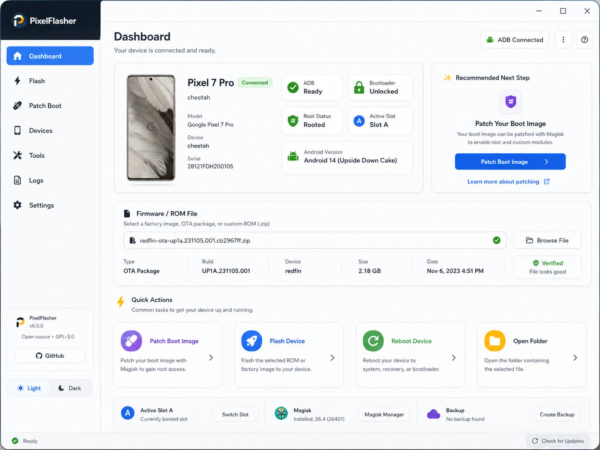
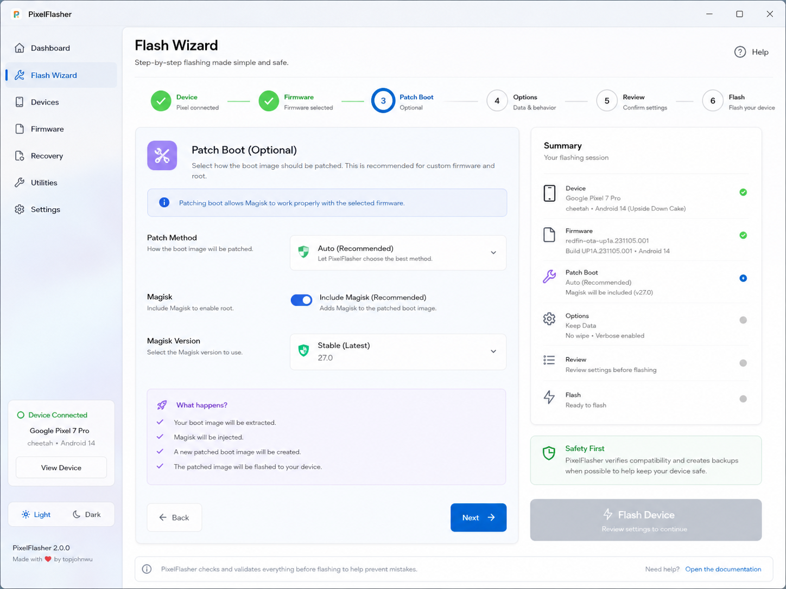
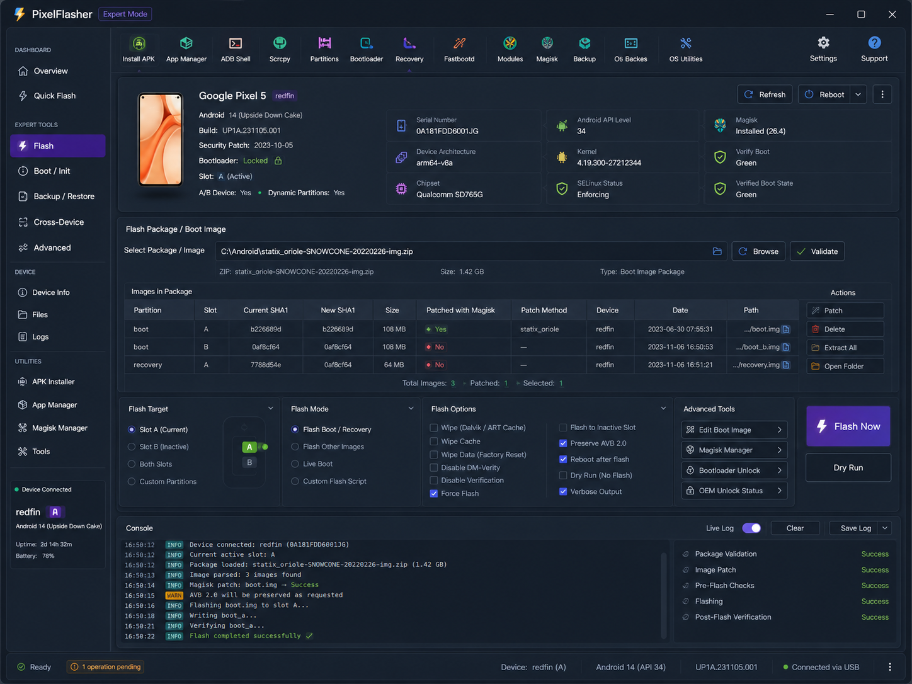

# PixelFlasher modern UI plan

This plan keeps the existing wxPython application and flashing logic intact while
modernizing the user experience in safe increments.

## Design direction

### 1. Dashboard first

The default screen should answer three questions immediately:

- Is my device connected?
- Is my firmware/package valid?
- What is the safest next action?

Concept image:



### 2. Guided Flash Wizard

New and intermediate users should not need to understand every advanced option
before they can perform a safe update. The wizard should split the flow into:

1. Device
2. Firmware
3. Patch Boot
4. Options
5. Review
6. Flash

Concept image:



### 3. Expert Mode

Power users still need dense controls, logs, tables, and advanced switches. The
expert view should group controls by risk and keep logs visible.

Concept image:



## Implementation sequence

Do not rewrite the full UI at once.

| Phase | Goal | Risk |
| --- | --- | --- |
| 1 | Add beta infra, diagnostics, platform utilities, UI tokens | Low |
| 2 | Extract visual helpers from `Main.py` into `ui/` | Low/Medium |
| 3 | Add new dashboard panel behind a feature flag | Medium |
| 4 | Add Flash Wizard using existing backend calls | Medium/High |
| 5 | Refine Expert Mode and reduce duplicated controls | Medium |
| 6 | Remove deprecated UI paths after beta validation | High |

## Rules for safe UI work

- Do not change flashing behavior in a UI-only PR.
- Keep destructive actions behind confirmation screens.
- Default to dry-run where possible in beta builds.
- Move platform-specific behavior into `platform_utils.py` before reusing it.
- Keep `Main.py` working until the replacement panels are proven.

## New foundation files

- `ui/theme.py` contains light/dark design tokens.
- `ui/icons.py` contains the modern SVG icon registry.
- `ui/components/models.py` contains wx-free view models for dashboard/wizard data.
- `platform_utils.py` centralizes Windows/Linux/macOS compatibility helpers.

## Feature flag recommendation

When the first new panel is wired into the app, gate it with a config flag:

```json
{
  "modern_ui_enabled": false,
  "modern_dashboard_enabled": false,
  "flash_wizard_enabled": false
}
```

That allows beta testers to switch back to the legacy UI when reporting bugs.
